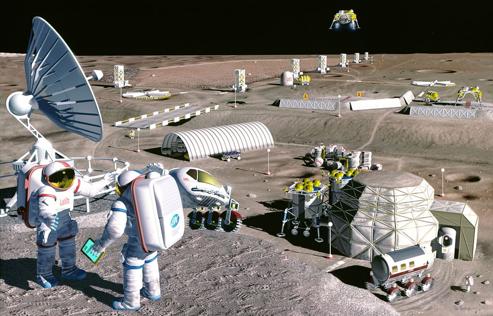

# Overview of the Space Sector: Trends and Future Directions

## Introduction

The space business is a fast expanding and ever-changing area that includes a wide range of operations.

It covers space exploration, satellite development and launch, and satellite-based service offerings. Since the first satellite was launched in 1957, the industry has gone a long way, and it now plays an important role in many facets of contemporary life, from communication and navigation to weather forecasting and scientific research.

The space sector is continuously changing, and being up-to-date on the newest trends and breakthroughs is crucial to understanding and managing the future of space.

This article presents a brief review of a few developments in the space industry, such as commercialization, the introduction of microsatellites (MicroSats), progress in space exploration and colonization, improvements in space propulsion, and efforts to control space debris.

## Commercialization of Space

### Increase in Private Companies Entering the Market

> While governments will always have a regulatory role, it falls now upon entrepreneurs, managers, investors, and innovators to develop new commercial space systems that are devised to benefit humanity today and in the future to the greatest extent possible. **(McElroy, 2022)** (The Space Industry of the Future Capitalism and Sustainability in Outer Space)

In recent years, the number of private companies entering the space sector has increased significantly. This trend can be attributed to the increasing commercialization of space and technological advancements that have made it simpler and more affordable for private companies to engage in space-related activities. There are numerous private companies involved in the space industry today, from satellite suppliers to space tourism companies.

Investment in space technology is one of the most important ways in which private companies contribute to the space sector. This investment is supporting the economy and driving innovation in the field. Entrepreneurs are driving innovation in the space sector, from the creation of novel propulsion systems to the development of new satellite technologies. This innovation not only pushes the limits of what is possible in space exploration, but also generates new business opportunities and stimulates employment growth in associated industries.

As a result of this increased private sector activity in space, a growing number of space analysts and economists have begun to refer to the "Space Economy" as a growth driver. This concept refers to the various economic activities that occur in the space sector, such as satellite production, launch services, space tourism, and asteroid mining. As the Space Economy continues to expand and evolve, it has the potential to generate new markets and industries, propel technological advancements, and present new opportunities for entrepreneurs and investors.

### Expansion of Space Tourism

> From suborbital flights to lunar excursions, space tourism is taking off and changing the way we view the final frontier.

With technological advancements and the increasing viability of space travel, the space tourism market is anticipated to expand substantially in the coming years. The development of reusable rockets and spacecraft by private companies aims to make space travel more accessible to the general public.



The development of new technology and infrastructure to support space tourism will likely be prompted by private companies' investments in this industry and increased public interest. In turn, this will generate new opportunities and stimulate the expansion of related industries.

Those who have always desired to explore the final frontier can enjoy a thrilling and one-of-a-kind adventure through space tourism. With plans for suborbital flights and even lunar excursions in the works, space tourism is positioned to play a significant role in the commercialization of space.

The growth of space tourism represents an intriguing shift in the space industry and has the potential to revolutionize how people perceive and experience space. Stay informed as the evolution of space tourism continues.

## Emergence of CubeSats and MicroSats

> Small but mighty: How CubeSats and MicroSats are revolutionizing the space industry.

Small satellites, such as CubeSats and MicroSats, have grown in popularity over the past few years, and for good reason. These miniature marvels offer numerous advantages that larger, more conventional spacecraft simply cannot match. Small satellites, for instance, can be launched quickly and affordably, making it easier to send multiple satellites into orbit simultaneously. This enables the creation of larger, more complex satellite constellations that can be used for a variety of applications, including remote sensing, communication, and navigation. Smaller satellites are also well-suited for applications that larger spacecraft may not be able to perform, such as monitoring weather patterns, tracking the migration of wildlife, and observing natural disasters.



In addition to their adaptability, small satellites offer a number of additional benefits. For instance, they are typically significantly less expensive to develop and launch than their larger counterparts, making them more accessible to organizations with limited budgets. They are also lighter, requiring less fuel to launch and allowing for easier transport. In addition, the smaller size of these satellites permits greater design flexibility and the ability to modify or upgrade the satellite once it is in orbit.

Given their numerous benefits, it is not surprising that small satellites are gaining importance for a wide range of applications, from remote sensing to earth observation. Government agencies such as NASA and the European Space Agency, in addition to private companies, are investing heavily in the development and deployment of small satellites. As the technology continues to advance, the capabilities of these miniature spacecraft are practically limitless. Small satellites will likely play a significant role in the future of space exploration, such as for monitoring weather patterns, tracking wildlife migration, or observing natural disasters.

## Space Exploration and Colonization

> A new era of space exploration: life support systems and long-duration missions are paving the way for human settlements beyond Earth.

### Return to the Moon and Plans for a Lunar Base

The moon has recently been identified as an essential exploration target, with several nations and private companies announcing plans to construct a lunar facility that will serve as a stepping stone for deeper space missions. The moon's potential to provide valuable resources and data for future missions has made it an important target for space exploration. Moreover, the establishment of a lunar base could provide a platform for conducting scientific experiments and developing new technologies, as well as a potential launch site for future missions to other planets or asteroids.

 <figure>    <figcaption> <small>     </small> </figcaption></figure> 

### The Next Frontier for Human Exploration: Mars

A mission to Mars is becoming more feasible due to recent technological advancements and the increased capabilities of private enterprises. Mars has been the focus of human exploration for decades. Exploration of Mars has the potential to shed light on the origins of life, the viability of future human settlements, and the planet's resources. In addition to paving the way for future missions to other planets and asteroids, establishing a presence on Mars could provide a platform for conducting scientific experiments and developing new technologies.

### Advancements in Life Support Systems and Extended Mission Durations

Exploration and colonization of space require life support systems and the capacity to support long-duration missions. Significant recent progress has been made in these fields, with the development of new technology and procedures to facilitate human exploration and colonization beyond Earth. These evolutions include the creation of innovative life support systems, radiation shielding, and the capacity to recycle resources. These scientific advances are crucial to the success of future missions to the moon and beyond, as they will ensure the safety and well-being of astronauts during long-duration missions and enable the establishment of permanent human settlements in space.

## Advancements in Space Propulsion

> If one can figure out how to effectively reuse rockets just like airplanes, the cost of access to space will be reduced by as much as a factor of a hundred. A fully reusable vehicle has never been done before. That really is the fundamental breakthrough needed to revolutionize access to space. **Elon Musk**

### The Creation of Reusable Rockets

In recent years, the development of reusable rockets has been one of the most exciting advances in the space industry. Reusable rockets have the potential to drastically reduce the price of space travel, making it more affordable for government and commercial missions. The effective recovery and reuse of rocket stages is intended to lower the cost of space access, allowing for more missions and more frequent launches.



### Investing in New Propulsion Technologies

Along with the improvement of reusable rockets, investment in novel propulsion technologies has increased. New propulsion technologies, ranging from electric propulsion to nuclear-powered systems, are being researched to provide more efficient and cost-effective alternatives for space travel. These technologies have the potential to revolutionize the space industry and make future trips to the moon, Mars, and beyond possible.

## Space Debris and Mitigation

> Out of sight, out of mind? The hidden danger of space debris and its impact on our future in space.

### Increase in Space Debris and Potential Threats to Operational Satellites

The increasing number of space launches and missions has resulted in a rise in space debris. This debris, which includes spent rocket stages and defunct satellites, endangers current satellites as well as future missions. The growing volume of space debris highlights the importance of appropriate mitigation techniques to deal with the issue.
A specific article on the subject can be found at [space-debris](/space-debris). 

### Efforts to Track and Remove Space Debris

Efforts to detect and remove space debris have increased in recent years. These initiatives attempt to limit the amount of space debris and minimize possible dangers to operating satellites and future missions, from the development of new tracking systems through the deployment of cleanup missions.

 
### Importance of International Cooperation in Addressing the Issue

Space debris is a global issue that requires international collaboration to be addressed effectively. International collaboration is crucial to ensuring the long-term sustainability of the space environment, from the formulation of international norms for space debris reduction through coordinated cleanup operations.
More on International cooperation at [Space Diplomacy](/space-diplomacy/#competition-and-cooperation)

## Conclusion

> Keeping up with space industry trends is essential. Monitoring the space sector and keeping up with new developments will help predict space exploration and trade.

The commercialization of space, the emergence of nanosatellites, advances in space exploration and colonization, breakthroughs in space propulsion, and initiatives to manage space debris are a few of the few significant themes in the space industry that have been discussed in this article. These trends, ranging from the increasing capabilities of private companies to the declining cost of accessing space, have the potential to stimulate greater growth and innovation in the sector. With the possibility of new discoveries, new technologies, and new commercial opportunities, the future of space exploration and commerce is becoming more and more exciting.

## A few insights

McElroy. (2022). The Space Industry of the Future Capitalism and Sustainability in Outer Space. Taylor  Francis, https://www.taylorfrancis.com/books/mono/10.4324/9781003268734/space-industry-future-mark-mcelroy-jr

Space tourism | Companies, History, & Facts. (n.d.). Encyclopedia Britannica. Retrieved February 7, 2023, from https://www.britannica.com/topic/space-tourism

What are SmallSats and CubeSats? (n.d.). NASA. Retrieved February 7, 2023, from http://www.nasa.gov/content/what-are-smallsats-and-cubesats

The next frontier for planetary and human exploration. (n.d.). Retrieved February 7, 2023, from https://www.researchgate.net/publication/330367893_The_next_frontier_for_planetary_and_human_exploration

