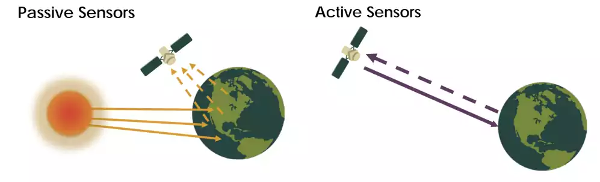
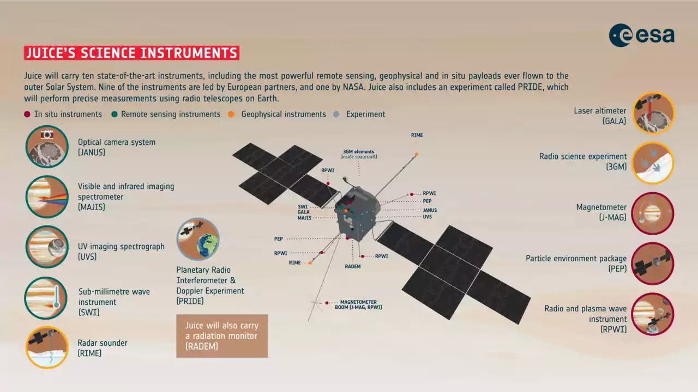
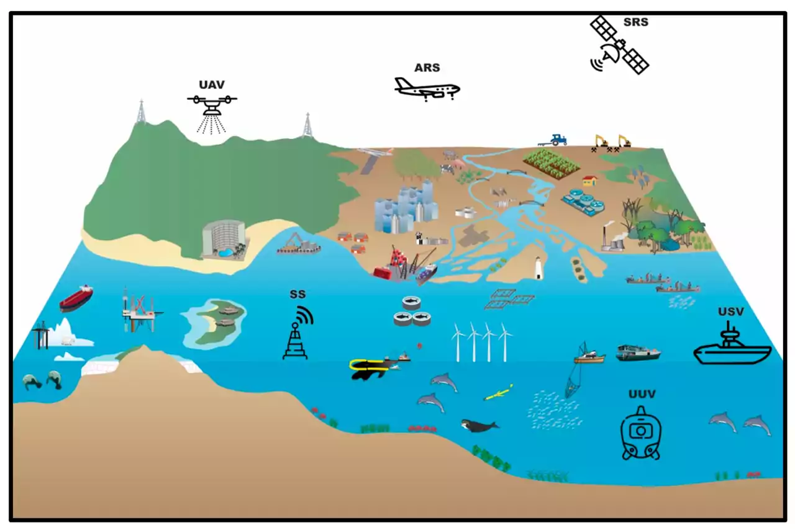
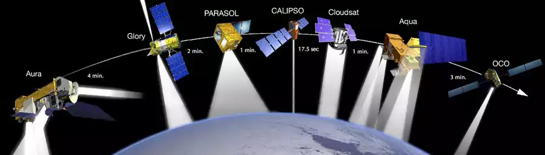
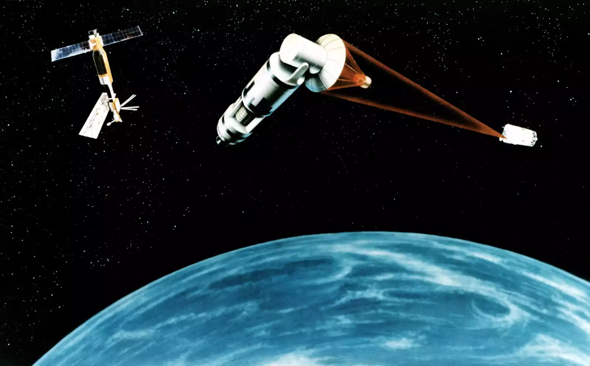
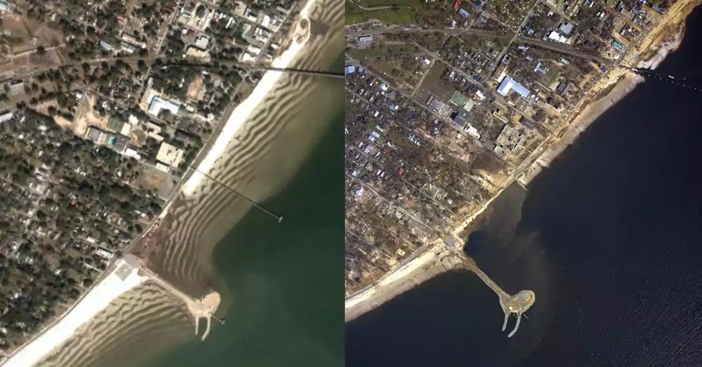

# Satellite Remote Sensing: Strategic, Technological, and Economic Aspects

## Introduction

Remote sensing refers to the process of acquiring information about an object or phenomenon from a distance. This information is collected using instruments or sensors that are mounted on platforms such as satellites, aircraft, or drones. The technology has revolutionized the way we study and understand our planet, as well as opened up new opportunities for research and application in a wide range of fields.

The purpose of this article is to provide a comprehensive overview of satellite remote sensing, focusing on its strategic, technological, and economic aspects. We will explore how remote sensing works, the different types of remote sensing, and the benefits it provides. Additionally, we will delve into its applications in various industries and fields, including military, space science, and the construction of smart cities.

This article will discuss a few of the major aspects of remote sensing. However, it will also cover the future development trends of satellite remote sensing technology and the incorporation of remote sensing data into a variety of industries and fields. Finally, we will soon examine the significance of the high-resolution Earth observation satellite system in various nations.

### Passive and Active remote sensing

There are two main types of remote sensing: passive remote sensing and active remote sensing.

>- **Passive Remote Sensing:** Passive remote sensing involves the detection of naturally occurring energy from the Earth's surface, such as visible light, infrared radiation, and microwave radiation. Passive remote sensors do not emit energy and simply detect the energy that is already present. Examples of passive remote sensing include the use of cameras for visible light imaging and infrared sensors for thermal imaging.
>- **Active Remote Sensing:** Active remote sensing involves the emission of energy from the sensor towards the Earth's surface, and the detection of the reflected energy. Active remote sensing can provide higher resolution data compared to passive remote sensing, as the energy can be focused and directed towards specific areas. Examples of active remote sensing include radar and lidar systems.

 <figure>    <figcaption> <small> Credit: NASA Applied Remote Sensing Training Program></a> </small> </figcaption></figure> 

### Sensor types

The sensors collect information in different forms, including electromagnetic radiation, such as visible light and infrared, as well as other forms of energy, such as radar and lidar.
Are some of the most common remote sensing sensors used for Earth observation from space,  with examples of satellites that use each type of sensor:

> - **Optical sensors** detect and measure reflected or emitted light from the Earth's surface. They are the most common type of remote sensing sensor, and are used for a wide variety of applications, including land cover mapping, vegetation monitoring, and disaster response. (Landsat 8, Sentinel-2, MODIS)
> - **Radar sensors** emit radio waves and measure the reflected signal. They can be used to collect data in all weather conditions, including at night. Radar sensors are often used for applications such as sea ice monitoring, flood mapping, and ground-penetrating radar. (Sentinel-1, TerraSAR-X, COSMO-SkyMed)
> - **LiDAR sensors** measure the distance to the Earth's surface by emitting and measuring laser pulses. They can be used to create high-resolution 3D models of the Earth's surface. LiDAR sensors are often used for applications such as urban planning, forestry, and geology. (ICESat, TanDEM-X, GEDI)
> - **Thermal infrared sensors** measure the heat emitted from the Earth's surface. They can be used to identify hot spots, such as wildfires, and to monitor changes in land cover. Thermal infrared sensors are often used for applications such as fire detection, agriculture, and climate change research. (Landsat 8, Sentinel-3, Aqua)
> - **Multispectral sensors** collect data in multiple bands of the electromagnetic spectrum. This allows them to capture more information about the Earth's surface than single-band sensors. Multispectral sensors are often used for applications such as land cover mapping, vegetation monitoring, and crop health assessment. (Landsat 8, Sentinel-2, MODIS)
> - **Hyperspectral sensors** collect data in hundreds of narrow bands of the electromagnetic spectrum. This allows them to create detailed spectral signatures of objects on the Earth's surface, which can be used for a variety of applications, such as material identification, crop stress detection, and environmental monitoring. (EnMAP, HyspIRI, Hyperion)

These are just a few of the many remote sensing sensors that are used for Earth observation from space. The type of sensor that is best suited for a particular application will depend on the specific needs of the user.

 <figure>    <figcaption> <small> ESA’s Jupiter Icy Moons Explorer (Juice) will carry the most powerful remote sensing, geophysical, and in situ payload complement ever flown to the outer Solar System. It includes 10 dedicated scientific instruments, a radiation monitor (RADEM) and the Planetary Radio Interferometer & Doppler Experiment (PRIDE). European Space Agency  <a target=_blank  target="_blank" href=https://www.esa.int/ESA_Multimedia/Images/2022/12/Juice_s_science_instruments>source link</a> </small> </figcaption></figure> 

## Remote Sensing Equipments

There are many different equipments used in remote sensing, each with its own set of strengths and weaknesses. They can be components of satellite imaging systems, airborne remote sensing platforms, and ground-based remote sensing systems.

> - **Satellite imaging systems** are large, complex systems that are designed to capture high-resolution images and data from space. They are often used for large-scale mapping and monitoring projects, as well as for military reconnaissance and surveillance.
> - **Airborne remote sensing platforms**, such as aircraft and unmanned aerial vehicles, are designed to collect data from lower altitudes. They are often used for detailed mapping and monitoring of smaller areas, as well as for environmental and geological research.
> - **Ground-based remote sensing systems** are typically used for monitoring and measuring environmental variables, such as temperature, humidity, and atmospheric pressure. These systems are often smaller and less complex than satellite and airborne systems, but they can be more easily deployed in remote and challenging environments.
>

 <figure>    <figcaption> <small> Remote sensing of coastal and marine environment <a target=_blank  target="_blank" href=https://doi.org/10.3390%2Frs12142313>https://doi.org/10.3390%2Frs12142313</a> </small> </figcaption></figure> 

Ultimately, the choice of remote sensing tool will depend on a variety of factors, including the specific needs of the project, the type of data being collected, and the budget and resources available.

## Benefits and advantages of Remote Sensing from space

A short and simple summary can be helpful.

- **Cost-effectiveness:** Remote sensing allows for the collection of data over large areas in a cost-effective manner, as the sensors can be  mounted on satellites or aircraft that can cover large areas quickly.  This can be much more cost-effective than traditional methods, such as  ground-based surveys, which can be time-consuming and expensive.
- **Time-saving:** Remote sensing can also save time compared to  traditional methods, as the data can be collected and analyzed quickly.  This allows for quicker decision-making and a more rapid response to  events, such as natural disasters or changes in land use.
- **High resolution:** Space-based remote sensing can provide  high-resolution data, as satellites can be equipped with advanced  sensors and imaging systems. This can provide detailed information about the Earth’s surface and environment.
- **Global coverage:** Space-based remote sensing provides global  coverage, as satellites can be positioned in orbit to provide coverage  of the entire Earth’s surface. This allows for the collection of data  from remote and inaccessible areas, such as the poles, deserts, and  oceans.
- **Repeat coverage:** Satellites can be programmed to revisit the same  area repeatedly, allowing for the collection of data at regular  intervals. This can be useful for monitoring changes over time, such as  the progression of a disaster or the growth of crops.
- **All-weather capabilities:** Space-based remote sensing can provide  data in all weather conditions, as satellites are not affected by  weather conditions on the ground. This can be useful for collecting data in areas with extreme weather conditions, such as hurricanes or  wildfires.
- **Unobstructed view:** Space-based remote sensing provides an  unobstructed view of the Earth’s surface, as satellites are not affected by obstacles, such as trees and buildings, that can obstruct the view  from the ground or from an aircraft.
- **Independence from ground infrastructure:** Space-based remote sensing  is independent from ground infrastructure, as satellites do not rely on  ground-based systems for data collection and transmission. This makes it ideal for collecting data in remote and inaccessible areas where  ground-based infrastructure may not be available.

## Application of Remote Sensing

### Space Science

 <figure>    <figcaption> <small> The satellites comprising the A-train (satellite constellation) after the 2009 launches. -  -  - <a target=_blank  target="_blank" href=http://glory.gsfc.nasa.gov/images/a-train.jpg>http://glory.gsfc.nasa.gov/images/a-train.jpg</a> </small> </figcaption></figure> 

Remote sensing in space science refers to the use of satellite technology to collect and analyze data about the Earth and other celestial objects. This technology is used to gather information about the environment, including the land, ocean, and atmosphere, as well as other celestial bodies. Remote sensing in space science has revolutionized the way we study the Earth and the universe, providing a unique perspective that would be otherwise impossible to obtain.

Remote sensing in space science is used in a variety of applications, including environmental monitoring, weather forecasting, climate change research, and planetary exploration. For example, remote sensing satellites can be used to track changes in the Earth's land cover, including deforestation, urbanization, and desertification. They can also be used to monitor natural disasters, such as hurricanes, earthquakes, and volcanic eruptions, providing valuable information that can be used to mitigate their impact.

### Military Applications

 <figure>    <figcaption> <small> An artist's concept of a Space Laser Satellite Defense System. - source unknown -  </small> </figcaption></figure> 

Remote sensing technology plays an important role in military operations and defense. With the ability to gather data from the air or space, remote sensing provides the military with valuable information for a variety of purposes, including reconnaissance, surveillance, target acquisition, and situational awareness.

In military operations, remote sensing can be used to gather intelligence on enemy positions, movements, and capabilities. By analyzing data collected from remote sensing sensors, the military can obtain real-time information on the battlefield, allowing them to make informed decisions and respond to threats quickly and effectively.

### Various Industries and Fields

Remote sensing has been increasingly integrated into various industries and fields, playing a crucial role in improving and advancing society. The use of satellite remote sensing in the construction of smart cities allows for efficient and effective planning and management, providing valuable information on urban growth, transportation, and resource distribution. The high quality and diverse remote sensing data also plays a vital role in national census and environmental improvement, allowing for comprehensive analysis and understanding of the planet and its resources. The "Internet + remote sensing" concept enhances the remote sensing industry by incorporating technology and big data analytics, making the data even more accessible and useful. Internet companies have also played a significant role in promoting the development of satellite remote sensing services, making the technology more widely available and utilized in various fields and industries.

 <figure>    <figcaption> <small> Katrina Before & After Bay St. Louis, Mississippi<a target=_blank  target="_blank" href=https://www.flickr.com/photos/noaaimages/20661669296/>https://www.flickr.com/photos/noaaimages/20661669296/</a> </small> </figcaption></figure> 

The information collected by remote sensing is used to create images or maps that provide detailed information about various phenomena, such as:

- Environmental monitoring: Remote sensing plays a critical role in  environmental monitoring, as it provides information about the Earth’s  atmosphere, oceans, and land use. This information can be used to  monitor changes in the environment, such as the progression of an oil  spill, or to study the impact of human activities on the environment.

- Disaster response: Remote sensing can also play an important role in disaster response, as it can provide critical information about the  extent of a disaster and the damage caused. This information can be used to support rescue and recovery efforts and to provide aid to those  affected.
- Agricultural and forestry management: Remote sensing can be used to  support agricultural and forestry management, as it provides information about land use, vegetation, and soil moisture. This information can be  used to improve crop yields, reduce waste, and conserve natural  resources.

## Future development trends of satellite remote sensing technology

The future of satellite remote sensing technology is bright, with new innovations and advancements being made all the time. One of the biggest trends in the field is the development of high-resolution Earth observation satellites, which will provide even more detailed information about our planet and its environment. Another trend is the integration of remote sensing data with other technologies, such as the Internet of Things (IoT), artificial intelligence (AI), and big data analytics, to provide even more valuable insights and information. With these developments, remote sensing in space science will continue to play a critical role in our understanding of the Earth and the universe.

### The High-Resolution Earth Observation Satellite System

The High-Resolution Earth Observation Satellite System, which combines Low Earth Orbit (LEO), Medium Earth Orbit (MEO), and High Earth Orbit (HEO) satellites, is a state-of-the-art system for remote sensing. This system provides high-resolution images of the Earth, allowing for detailed and accurate information on various aspects such as terrain, agriculture, forestry, and urban areas. The integration of LEO, MEO, and HEO satellites provides a comprehensive view of the planet, making it possible to monitor and analyze changes over time. 

High-resolution earth observation satellites have become increasingly important for military, scientific, and commercial purposes. The development of this technology has attracted the attention of major countries around the world, each with their own plans for the future of space-based remote sensing.

- In the United States, the military has developed a system for space-based high-resolution integrated reconnaissance and surveillance. This system is used to gather information and intelligence for military operations and decision-making, in order to maintain its technological advantage and to support its national security interests. The US system for high-resolution integrated reconnaissance and surveillance is a critical component of its overall military strategy and capabilities.

- Europe has a long history of remote sensing and earth observation through satellite technology. The European Space Agency (ESA) . The Copernicus program, run by the European Commission in partnership with ESA, is a leading provider of earth observation data and services, offering free and open access to its data. France, on the other hand, has proposed an optical imaging satellite system that will combine low earth orbit (LEO), medium earth orbit (MEO), and high earth orbit (HEO) satellites to provide high-resolution imagery. This system is aimed at providing France with a strategic advantage in terms of earth observation capabilities.

- The Chinese government sees the development of its high-resolution earth observation satellite system as a key component of its long-term strategy for space exploration and utilization, with the launch of several high-resolution earth observation satellites that offer a variety of capabilities, including high-resolution imaging, video, and data transmission. 

- The Russian space agency, Roscosmos, operates a range of remote sensing satellites for both civilian  and  military applications, to enhance its national security by providing real-time intelligence and monitoring capabilities. The country has also been actively involved in the development of earth observation systems for other countries.

- India has a growing focus on the development and use of high-resolution earth observation satellite systems. The Indian Space Research Organisation (ISRO) has launched several satellites for earth observation and remote sensing, including the Cartosat series, which provides high-resolution imagery for various applications including land use and land cover mapping, urban planning, coastal zone management, and disaster management. 

## Conclusion

Remote sensing technology has revolutionized the way we study and understand our planet. With the ability to detect and measure energy from the Earth's surface, remote sensing provides valuable information for a wide range of applications, including mapping, land cover analysis, disaster management, and environmental monitoring.

From passive remote sensing, which detects naturally occurring energy, to active remote sensing, which emits energy from the sensor, remote sensing technology has come a long way since its early days. Today, remote sensing can be divided into several subtypes, including optical, radar, thermal, and lidar remote sensing, each with its own unique applications and capabilities.

The future of remote sensing technology is bright, with new developments such as the high-resolution Earth observation satellite system, the integration of remote sensing data into various industries and fields, and the "Internet + remote sensing" concept set to enhance the remote sensing industry.

In conclusion, remote sensing technology is an essential tool for understanding and managing our planet, and its significance and impact will only continue to grow in the coming years.

## A few insights

- 
   [What is Remote Sensing? | Earthdata. ](https://www.earthdata.nasa.gov/learn/backgrounders/remote-sensing)
  explains what remote sensing is, how it works, and what kinds of data it produces. It also provides some examples of how remote sensing data are used for scientific research and applications.

-  [15 Free Satellite Imagery Data Sources - GIS Geography. ](https://gisgeography.com/free-satellite-imagery-data-list/ )
  lists 15 sources of free satellite imagery data that anyone can access online. It also gives some information about the types of satellites, sensors, and resolutions that are available.

-  [ESA - ERS at a glance - European Space Agency. ](https://www.esa.int/Applications/Observing_the_Earth/ERS_at_a_glance)
  describes the ERS satellites, which were launched by ESA in 1991 and 1995. It highlights some of their achievements and contributions to Earth observation.

- [Satellite Remote Sensing - an overview | ScienceDirect Topics.]( https://www.sciencedirect.com/topics/earth-and-planetary-sciences/satellite-remote-sensing )
- [Satellite Remote Sensing Technologies | SpringerLink.](https://link.springer.com/book/10.1007/978-981-15-4871-0 )
- [Key Trends in Remote-Sensing Satellite Systems and Services.](https://link.springer.com/chapter/10.1007/978-3-030-15281-9_3 )
