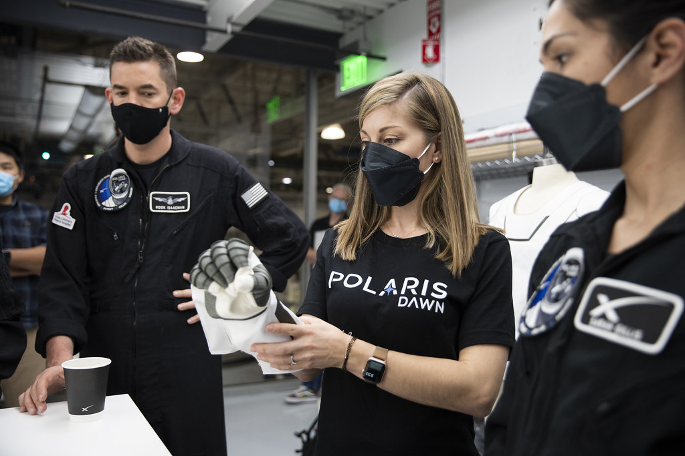
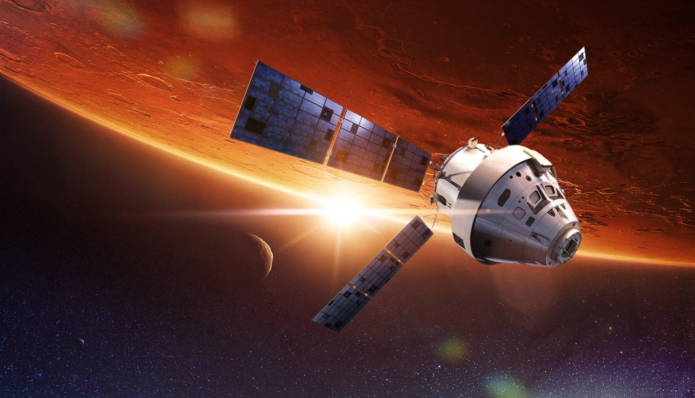

# SpaceX’s Polaris Dawn: The Most Ambitious Private Space Mission Ever

<small>featured image - Polaris Dawn crew Photo credit: Polaris Program / John Kraus  <a target=_blank  target="_blank" href=https://www.flickr.com/photos/polarisprogramphotos/51880949610/in/photostream/>source link</a> </small>

## Introduction

The Polaris Program is an upcoming series of commercial space missions conducted by civilian astronauts. It is a first-of-its-kind effort to further humanity's exploration of space and contribute to the advancement of Earthly endeavors. The program will undertake a series of intrepid missions aimed at resolving issues through the application of innovative technologies and methods. The Polaris Program is significant because it represents a significant advancement in human space exploration, particularly in the realm of private sector participation in space travel. Polaris Dawn, the first mission of the Polaris Program, is scheduled to launch no earlier than Q4 2022 from the historic Launch Complex 39 at NASA's Kennedy Space Center.

## Overview of the Polaris Dawn Mission

Polaris Dawn is a historic private space mission that will try to reach the highest Earth orbit ever flown by humans. The mission is part of the Polaris Program, a visionary initiative that aims to inspire humanity and advance space exploration through three groundbreaking missions: Polaris Dawn, Polaris Starlight and Polaris Moonlight.

The mission has several goals and objectives, such as:

- Testing Starlink laser-based communications in space, which could make future missions to the Moon, Mars, and other places faster and more reliable.
- Through the Starlink network, 100 schools in Chile and Brazil will get access to the internet, which will improve education and communication in poor areas.
- Conducting scientific experiments on board the spacecraft, such as measuring radiation exposure, monitoring biometric data and testing human performance in microgravity
- Raising awareness and funds for St. Jude Children's Research Hospital, which treats children with cancer and other life-threatening diseases
- Inspiring people around the world to pursue their dreams and passions in science, technology, engineering and mathematics (STEM)

 <figure>    <figcaption> <small>US Navy photo by Mass Communication Specialist 1st Class Chad Runge - Students participating in the annual Science, Technology, Engineering and Mathematics (STEM) program at the US Naval Academy    </small> </figcaption></figure> 

 The mission is scheduled to launch no earlier than July 2023 on a SpaceX Crew Dragon capsule atop a Falcon 9 rocket, with four people on board, including Jared Isaacman, an entrepreneur and pilot. The Polaris Dawn mission will utilize the SpaceX Crew Dragon capsule, which will be launched atop a Falcon 9 rocket from the Kennedy Space Center's historic Launch Complex 39A in Florida. The highlight of Polaris Dawn will be an extravehicular activity (EVA), which will be the first spacewalk from a Crew Dragon spacecraft or any commercial mission. Before the spacewalk, the Dragon spacecraft will ascend to a higher altitude than any previous Crew Dragon mission. Polaris Dawn is more than just a space mission; it represents humanity's hope, innovation, and exploration. It will expand the limits of spaceflight and pave the way for future missions that will take us deeper into the solar system.

## Crew Selection and Training

The crew members of the Polaris Dawn mission were selected based on their expertise, knowledge, and enthusiasm for spaceflight.

 <figure>    <figcaption> <small> Visiting the suit lab at SpaceX Photo credit: SpaceX  <a target=_blank  target="_blank" href=https://www.flickr.com/photos/polarisprogramphotos/51884408247>source link</a> </small> </figcaption></figure> 

Jared Isaacman and SpaceX are collaborating on the selection process. Experiments were chosen to be included in the mission profile, and additional testing and qualification requirements are currently underway. Among the 38 different experiments that will be conducted during the mission, two will involve eyecare. Additionally, the Polaris Dawn crew intends to conduct a spacewalk, which would be a first for a private astronaut mission. The training program for astronauts participating in the Polaris Dawn mission involves the creation of mission-specific curricula and the implementation of training for both NASA and commercial astronauts. The crew's training began in June 2022, with the third phase emphasizing teamwork. The mission is the first in a series beginning with Crew Dragon and concluding with the first crewed Starship flight. From September 8-18, 2022, the SpaceX Crew Polaris Dawn was stationed and trained at Bozeman Airport.

## Challenges and Risks Associated with Private Space Missions

Since the beginning of the space age, most space exploration has been done by government-funded agencies. These agencies have sent hundreds of missions into orbit and further since the beginning of the space age. However, in recent years, private companies have emerged as new players in the space industry, offering innovative and affordable solutions for accessing and utilizing space.

Private space missions face unique challenges that differ from those of government-funded space missions. Some of these challenges are:

- Regulatory and legal issues: Private space missions need to comply with various national and international laws and regulations regarding licensing, liability, safety and environmental protection. For example, NASA has updated its pricing policy for private astronaut missions on the ISS, which includes charges for crew supplies, power and data services.
- Technical and operational issues: Private space missions need to ensure that their spacecraft are reliable, safe and capable of performing their intended tasks. They also need to coordinate with other entities involved in the mission, such as launch providers, ground stations and orbital traffic management systems. For example, Polaris Dawn will try to reach an altitude of about 1,200 kilometers (745 miles), which poses challenges for communication and navigation.
- Concerns about money and the market: Private space missions need to get enough money from investors or customers to cover their costs and make a profit. They also have to figure out if their products or services are needed and if they can work in a market that is competitive and uncertain. For example, Inspiration raised $200 million for St. Jude Children's Research Hospital through donations from supporters.

Safety concerns associated with private space travel include radiation, altered gravity fields, hostile and closed environments, distance from Earth, and isolation and confinement. The current space tourism industry lacks government regulation or their own regulation, which poses a risk for orbital flights. Flights themselves are highly dangerous due to the short amount of time humans have been blasting off from the surface of Earth. Radiation is the first hazard of a human mission to Mars and is difficult to visualize.

## The Future of Private Space Exploration

 <figure>    <figcaption> <small> Space pictures   <a target=_blank  target="_blank" href=https://jooinn.com/images/space-pictures-51.jpg>source link</a> </small> </figcaption></figure> 

Because of private space missions, the space industry experiences both positive and negative outcomes. On the one hand, they generate employment, stimulate economic growth, and increase the competitiveness of European industries on the intense global market. In addition, they invigorate our pursuit of cosmic objectives and enable new scientific discoveries and innovations. On the other hand, they present challenges such as environmental risks, legal uncertainty, ethical dilemmas, and potential resource and interest conflicts. Private space companies will play a significant role in shaping humanity's relationship with outer space by allowing capital to expand into new areas, cooperating with the government to develop space, popularizing space without supplanting national governments, increasing the number of actors engaged in space exploration and extending the mission infrastructure of government agencies.

## Conclusion: The Significance of Polaris Dawn

SpaceX's Polaris Dawn mission is the most ambitious private space mission ever undertaken. It will push the boundaries of human space travel and demonstrate new methods for future space exploration. The mission will also benefit Earth because it will aid a worthy cause, provide internet access to remote areas, and inspire millions of people to travel to space. Polaris Dawn is not only a landmark achievement for SpaceX, but also for humanity as a whole, as it will provide new opportunities for expanding our understanding of the cosmos.

## A few insights

- Ledford, H. (2022). Private space mission aims to break altitude record. Nature, 601(7891), 468-469. https://doi.org/10.1038/d41586-022-03597-z
- Johnson, L. (2022). The Polaris Program: Advancing private space exploration through the integration of industry and academia. Journal of Aerospace Technology and Management, 14, e2005. https://doi.org/10.5028/jatm.v14.2005
- Berger, E. (2022, May 16). Inside the private space race: Polaris Dawn and the future of commercial spaceflight. Chicago Magazine. https://www.chicagomag.com/city-life/May-2022/Inside-the-Private-Space-Race-Polaris-Dawn-and-the-Future-of-Commercial-Spaceflight/
- Zaidi, A. (2022, June 24). Polaris Dawn: The first private space mission to break altitude record. Chicago Tribune. https://www.chicagotribune.com/business/ct-biz-polaris-dawn-first-private-space-mission-20220624-6jzg6rqlrjg7paz6f3q6l2g6yq-story.html
- Lerner, M. (2022, July 5). The Polaris Dawn mission: A new frontier for commercial space travel. Chicago Business Journal. https://www.bizjournals.com/chicago/news/2022/07/05/polaris-dawn-mission-commercial-space-travel.html

