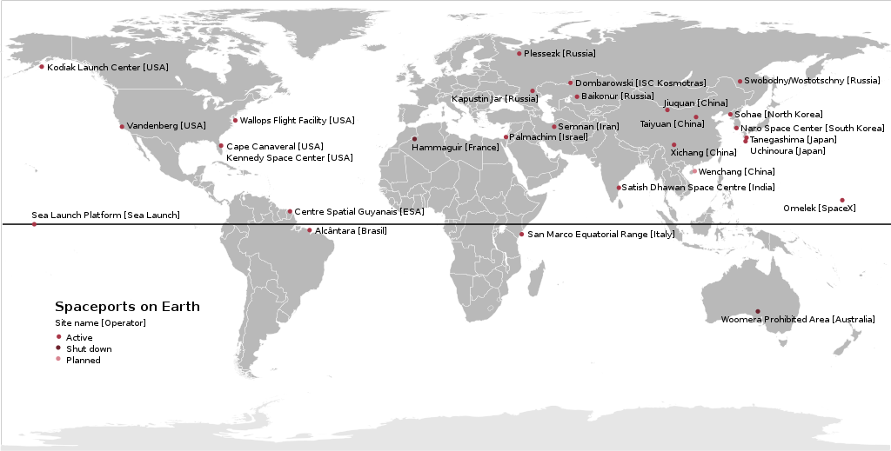
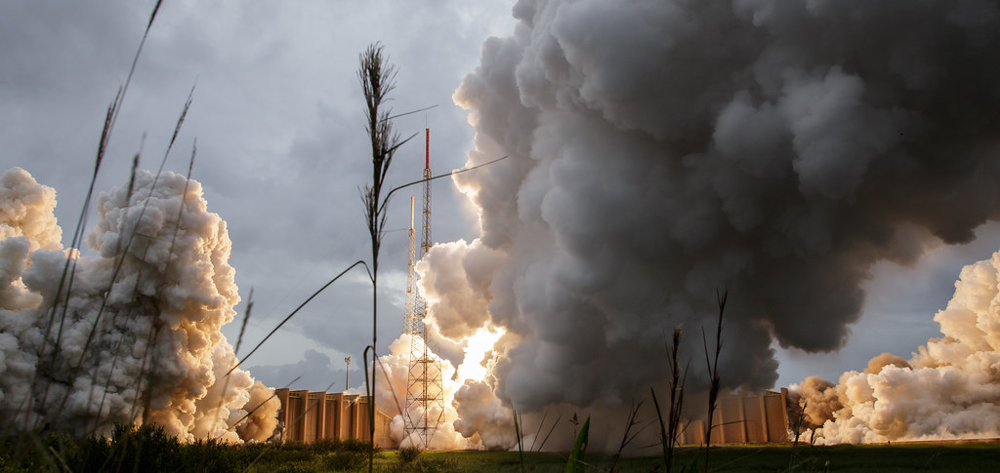
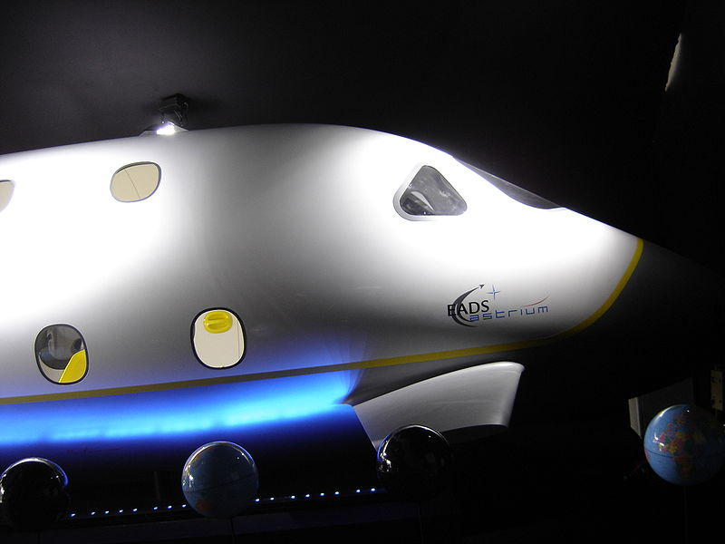
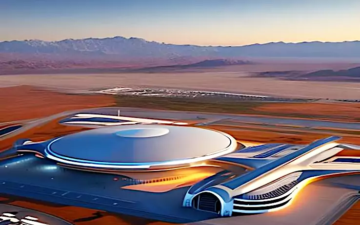

# Spaceports in Space Exploration

## Introduction

Spaceports are facilities intended for launching, landing, and servicing spacecraft. They typically include a runway, launch pads, mission control centers, and other necessary infrastructure for spacecraft operation. They serve as storage and maintenance sites for spacecraft, offering a secure environment for astronauts and personnel to train and prepare for space missions.  

As space exploration progresses, spaceports' significance amplifies. They've been a vital aspect of space technology and exploration development, from the earliest days of space travel until today. This post delves into the history of spaceports, their role in space exploration currently, and the difficulties in constructing and maintaining them. It also examines spaceports' potential economic impact and speculates on what the future holds for them. By the end, you'll have a clearer comprehension of spaceports' importance and their role in space exploration.

## Overview of Spaceports' History

The first spaceport in history was the Baikonur Cosmodrome in Kazakhstan, which was used by the Soviet Union to launch Sputnik 1, the first artificial satellite, in 1957. It was also from Baikonur that Yuri Gagarin became the first human in space in 1961. Since then, many other spaceports have been established around the world, each with its own features and capabilities.

Some of the most active and notable spaceports include Cape Canaveral Space Force Station and Kennedy Space Center in Florida, USA; Vandenberg Space Force Base in California, USA; Guiana Space Centre in French Guiana; Jiuquan Satellite Launch Center and Wenchang Spacecraft Launch Site in China; Tanegashima Space Center and Uchinoura Space Center in Japan; Satish Dhawan Space Centre in India; Plesetsk Cosmodrome and Vostochny Cosmodrome in Russia; among others.

## Role of Spaceports

Spaceports can support different types of launch vehicles, such as expendable or reusable rockets, spaceplanes, or air-launched systems. They can also have different launch complexes or pads for different missions or customers. Some facilities are specialized for certain orbital regimes or inclinations, such as polar orbits or geostationary orbits. They are used for processing, storing propellants, as well as for testing, assembling, or integrating spacecraft.

Spaceports are not only used for government or military purposes but also for commercial and civil activities. Many private companies have developed their own launch vehicles and spacecraft that use existing or new spaceports. Some examples are SpaceX, Blue Origin, Virgin Galactic, Rocket Lab, Astra, Firefly Aerospace etc. These companies offer services such as satellite launch, cargo delivery to orbit or to the International Space Station (ISS), human spaceflight (including space tourism), lunar exploration etc.

There are several types of spaceports, including government-owned, commercial, and military spaceports:

- Ggovernment-owned facilities, which are usually operated by national space agencies like NASA, ESA, and CNSA.
- Private facilities, which are owned and operated by companies such as SpaceX and Blue Origin.
- Military facilities, which are utilized for defense purposes like missile testing and satellite launches.

Different classes of spaceports exist based on their launch capabilities. Class 1 facilities are designed for suborbital launches. Class 2 and Class 3 facilities are designed for orbital launches.

They are also classified based on their geographical location, such as equatorial, polar, or inclined orbits. They are often located in remote areas away from populated regions and utilize complex infrastructure and equipment.

## Spaceports Around the World

 <figure>    <figcaption> <small> Map of the world showing spaceports on Earth. Data based on a table in de:Weltraumbahnhof as of 2013-12-29 version. Christallkeks  <a target=_blank  target="_blank" href=https://commons.wikimedia.org/wiki/File:Spaceports_on_Earth.svg>source link</a> </small> </figcaption></figure> 

In this section, we will provide an overview of the major spaceports around the world, their locations, and their missions. Comparing spaceports based on their capabilities and services is important for determining which launch facility is best suited for a particular mission. The following table compares some spaceports based on their capabilities, facilities, and services. 

| Spaceport                       | Location      | Missions                                                     | Capabilities                                   | Facilities                                                   | Services                                      |
| ------------------------------- | ------------- | ------------------------------------------------------------ | ---------------------------------------------- | ------------------------------------------------------------ | --------------------------------------------- |
| Baikonur Cosmodrome             | Kazakhstan    | Launching satellites, crewed missions, resupply missions to the ISS | Can launch Soyuz and Proton rockets            | Launch pads, integration facilities, tracking and telemetry stations | Fueling, payload integration, launch services |
| Kennedy Space Center            | United States | Crewed missions, resupply missions to the ISS                | Can launch Falcon 9 and Delta IV Heavy rockets | Launch pads, integration facilities, tracking and telemetry stations | Fueling, payload integration, launch services |
| Jiuquan Satellite Launch Center | China         | Launching satellites, crewed missions                        | Can launch Long March rockets                  | Launch pads, integration facilities, tracking and telemetry stations | Fueling, payload integration, launch services |
| Guiana Space Centre             | French Guiana | Launching satellites                                         | Can launch Ariane rockets                      | Launch pads, integration facilities, tracking and telemetry stations | Fueling, payload integration, launch services |
| Tanegashima Space Center        | Japan         | Launching satellites, crewed missions                        | Can launch H-IIA and H-IIB rockets             | Launch pads, integration facilities, tracking and telemetry stations | Fueling, payload integration, launch services |
| Spaceport America               | United States | Suborbital and orbital launches, commercial spaceflights     | Can launch SpaceShipTwo and LauncherOne        | Launch pad, hangar, mission control center                   | Payload integration, launch services          |

As the table shows, spaceports around the world vary in their missions, capabilities, and services. Some of them are primarily focused on launching satellites, while others are geared towards crewed missions and resupply missions to the International Space Station. Additionally, there is a growing trend towards commercial facilities, with Spaceport America being an example of a facility that caters to suborbital and orbital launches for private companies.

## Challenges facing Spaceports

### Cost of construction and maintenance

The building and maintaining costs are significant and must be carefully considered to ensure that it is sustainable over the long term. Factors contributing to the cost of construction and maintenance include the cost of materials, labor, and equipment. Additional costs are represented by the provision of the necessary infrastructure and services for spacecraft operation. Then there is the cost of training ground and support personnel as well as astronauts and the development and maintenance of the technological devices that allow the spaceport to operate.

### Environmental impact

The environmental impact of spaceports must also be considered. They can have a significant impact on the environment both in terms of the direct impact of the construction and operation of the facility, as well as the indirect impact of the activities it supports. Factors that can impact the environment include air and water pollution, soil erosion, and the loss of wildlife habitats. It is important to carefully consider the environmental impact of spaceports, and to take steps to minimize their impact wherever possible.

### Technical challenges

The development and operation of spaceports also presents a range of technical challenges. Their facilities must be designed and built to deal with equipment intended to endure the extreme conditions of space. They must be equipped as well as to provide the necessary communication and control systems to support their operation.

### Safety & Security

The operations safety and security  is of utmost importance. Spaceports must comply with strict safety and security regulations, including emergency procedures, access control and fire safety and  must also have the capability to respond to potential security threats and natural disasters.

### Competition for resources

An issue derives from competition with other infrastructure projects for limited resources, including funding, personnel and materials. This can make it difficult to build and maintain spaceports especially in countries with limited resources. It is important to be strategic in their approach to resource allocation, and to seek partnerships and collaborations with other organizations and governments to maximize their impact.

## Potential economic impact of spaceports

Spaceports can have significant economic impacts on the regions where they are located, as well as on the global space industry. However, these impacts depend on several factors, such as the level of public investment, the market demand, the regulatory environment, and the technological innovation.

### Jobs creation

One of the main benefits of spaceports is that they can create direct and indirect jobs in various sectors, such as aerospace engineering, manufacturing, construction, operations, maintenance, and services. For example, a <a href="https://publications.europa.eu/resource/cellar/cb805ac6-bc49-11e6-a237-01aa75ed71a1.0001.04/DOC_1" target="_blank">study by PricewaterhouseCoopers</a> estimated that the Copernicus program, which uses ESA's Sentinel satellites launched from various spaceports around the world, will generate a cumulative economic value of 13.5 billion euros for upstream and downstream users in the period 2008 to 2020. 

### Innovation and competitiveness

Another benefit of spaceports is that they can stimulate innovation and competitiveness in the space sector and related industries. Spaceports can provide opportunities for testing new technologies and developing new applications for existing ones. They can also attract private investment and foster collaboration among different stakeholders. For example, SpaceX has used its own launch site at Cape Canaveral to develop reusable rockets and lower launch costs. Virgin Galactic has partnered with New Mexico's Spaceport America to offer suborbital flights for tourists and researchers

### Encouraging space tourism

 <figure>    <figcaption> <small> EADS Astrium Space Tourism Project - Overall view of the mock-up, exterior Picture taken at the Paris Air Show 2007  <a target=_blank  target="_blank" href=https://en.wikipedia.org/wiki/File:EADS_Astrium_Space_Tourism_exterior.jpg>source link</a> </small> </figcaption></figure> 

The growth of space tourism represents a significant opportunity for spaceports to diversify their revenue streams. As more people become interested in space travel, spaceports can position themselves as a hub for space tourism providing facilities and services to support the growth of this industry.

## The future of spaceports

The future of spaceports may see more diversity and innovation as new technologies and markets emerge. Some of the trends  include:

- The development of reusable launch vehicles that can reduce launch costs and increase launch frequency.
- The emergence of new orbital destinations such as private space stations (e.g., Axiom Station), lunar bases (e.g., Artemis program), asteroid mining etc.
- The expansion of suborbital flights for tourism (e.g., Virgin Galactic) or point-to-point transportation (e.g., SpaceX Starship).
- The establishment of new regulatory frameworks and standards for safety, environmental protection, liability etc.
- The creation of new partnerships and collaborations among public and private entities across different countries and regions.

 <figure>    <figcaption> <small>     </small> </figcaption></figure> 

## A few insights

- Patel, Manish, and Herman Haeusler. "Spaceport infrastructure for the emerging space economy." Acta Astronautica 156 (2019): 1-12.

- Lappas, Vaios, and Mattia Perren. "Spaceport sustainability: challenges and opportunities." Journal of Cleaner Production 270 (2020): 122469.

- Stojčić, Davor, Svjetlana Srhoj, and Nevenka Čavlek. "Spaceports as a driver for regional development." Geographica Pannonica 23, no. 2 (2019): 69-82.

- 
  Johnson, Mark, and Yvonne Cheng. Artificial Intelligence and Space Exploration: Past, Present, and Future. CRC Press, 2021.

- Beattie, Donald. Human Spaceflight: From Mars to the Stars. Springer, 2019.

- Sadeh, Willy Z. Spaceports around the World: A Global Growth Industry. Routledge, 2018.
