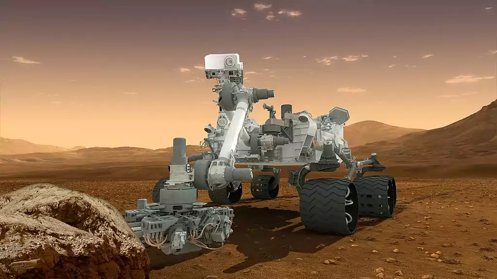
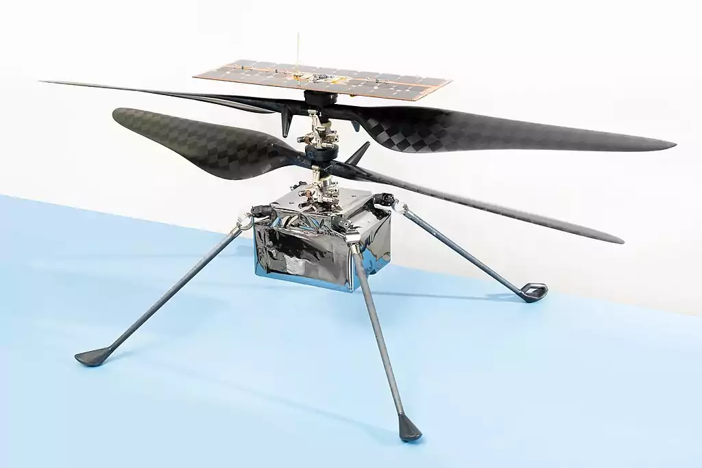
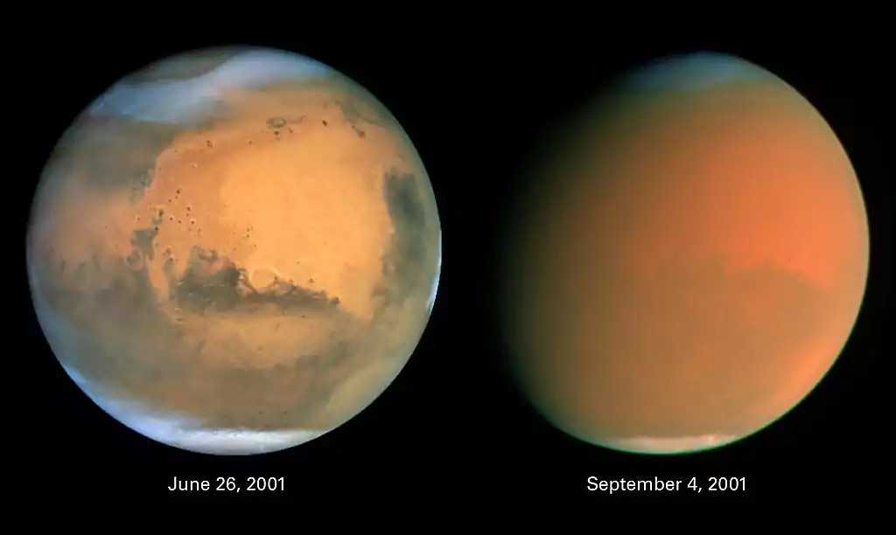
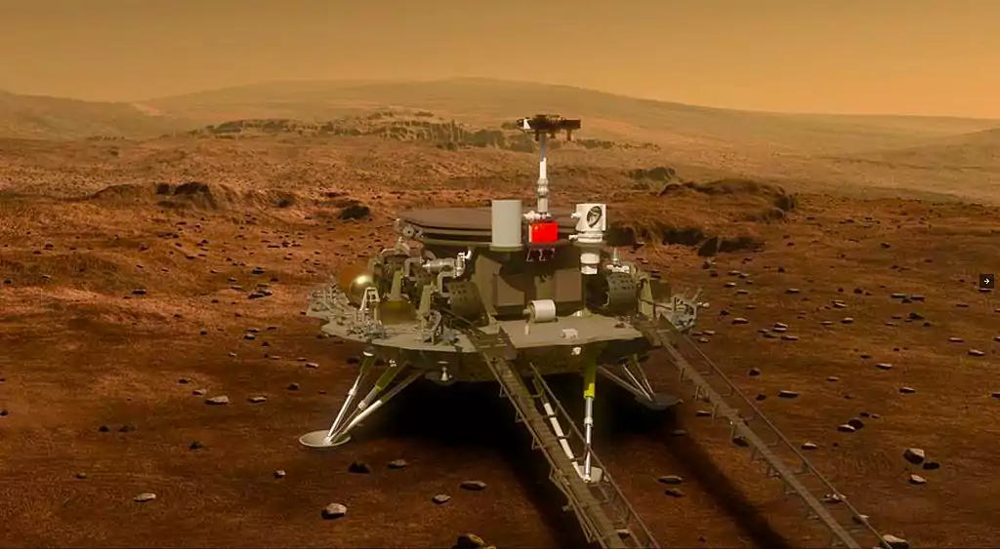

# The Ultimate Guide to Mars Exploration and Utilization

## **Introduction to Space Exploration**

> Human fascination with space has led to a rapid development of space exploration technologies and programs.

In the early 20th century visionaries such as Konstantin Tsiolkovsky and Robert Goddard envisioned the possibility of traveling to the stars. The Soviet Union launched the first artificial satellite Sputnik 1 in 1957, followed by the first human in space (Yuri Gagarin) in 1961. Since then numerous nations and organizations have participated in missions to investigate the Moon, planets, asteroids, comets and other celestial bodies.

Multiple orbiting satellites, robotic probes and rovers, in addition to human crews aboard the International Space Station, characterize the current state of space exploration. Space exploration is essential for advancing scientific understanding, fostering technological innovation, promoting international cooperation, and inspiring future generations.

## **Mars Exploration Missions and Technologies**

> To explore Mars and achieve human presence on the planet, a comprehensive set of strategies and technologies must be developed and implemented.

Mars is a fascinating planet whose past, present, and future habitability are shrouded in mystery. NASA and other space agencies have been pursuing a science-driven program of Mars exploration with four main objectives: determine whether life ever arose on Mars, characterize Mars' climate, characterize Mars' geology, and prepare for human exploration of Mars. To accomplish these objectives, numerous missions have been launched or are in the planning stages, employing cutting-edge technologies such as robust propulsion systems, inflatable heat shields, high-tech Martian spacesuits, rovers, helicopters, and sample return capabilities. 

 <figure>    <figcaption> <small> This artist's concept features NASA's Mars Science Laboratory Curiosity rover, a mobile robot for investigating Mars' past or present ability to sustain microbial life. Curiosity landed near the Martian equator about 10:31 p.m., Aug. 5 PDT (1:31 a.m. Aug. 6 EDT) In this picture, the rover examines a rock on Mars with a set of tools at the end of the rover's arm, which extends about 7 feet (2 meters). Two instruments on the arm can study rocks up close. A drill can collect sample material from inside of rocks and a scoop can pick up samples of soil. The arm can sieve the samples and deliver fine powder to instruments inside the rover for thorough analysis. The mast, or rover's "head," rises to about 6.9 feet (2.1 meters) above ground level, about as tall as a basketball player. This mast supports two remote-sensing science instruments: the Mast Camera, or "eyes," for stereo color viewing of surrounding terrain and material collected by the arm; and, the Chemistry and Camera instrument, which uses a laser to vaporize a speck of material on rocks up to about 23 feet (7 meters) away and determines what elements the rocks are made of. NASA/JPL-Caltech  <a target=_blank  target="_blank" href=http://www.nasa.gov/mission_pages/msl/multimedia/pia15791.html>source link</a> </small> </figcaption></figure> 

Here are some of the missions that have been launched or are in the planning stages:

- **Mars 2020:** Mars 2020 is a mission that includes the Perseverance rover and the Ingenuity helicopter. It is the first mission to Mars since Curiosity landed in 2012. Mars 2020's mission is to search for signs of ancient life, characterize the Martian climate and geology, and collect samples for future return to Earth.
- **Perseverance:** [Perseverance is a car-sized rover](https://mars.nasa.gov/mars2020/) that landed on Mars in February 2021. Its mission is to search for signs of ancient life, characterize the Martian climate and geology, and collect samples of rock and regolith (broken rock and soil) for possible return to Earth. Some of the instruments on Perseverance are “direct progeny” of the ones on Curiosity, which landed on Mars in 2012; both are part of the Mars Science Laboratory mission. The rover also carries a drill for coring samples from Martian rocks and soil.  Perseverance has made [several discoveries ](https://mars.nasa.gov/news/9098/nasas-perseverance-mars-rover-makes-surprising-discoveries/)during its time on Mars. Scientists with NASA’s Perseverance Mars rover mission have discovered that the bedrock their six-wheeled explorer has been driving on  likely formed from red-hot magma. The team has also concluded that rocks in the crater have interacted with water multiple times over the eons and that some contain organic molecules. 

- **Ingenuity:** [Ingenuity is a small robotic helicopter](https://www.jpl.nasa.gov/missions/ingenuity) that operates on Mars as part of NASA's Mars 2020 mission. It hitched a ride to Mars on the Perseverance rover and was deployed to the surface on April 3, 2021. On April 19, it successfully made the first powered controlled extraterrestrial flight by an aircraft, taking off vertically, hovering, and landing for a flight duration of 39.1 seconds. Ingenuity’s mission is experimental in nature and completely independent of the rover’s science mission. The helicopter completed its technology demonstration after three successful flights and has since transitioned to a new operations demonstration phase to explore how future rovers and aerial explorers can work together.

- **ExoMars 2022:** [ExoMars 2022](https://exploration.esa.int/web/mars/-/48088-mission-overview) is a joint mission between the European Space Agency (ESA) and Roscosmos that was planned to launch in 2022. The mission was to deliver a European rover, Rosalind Franklin, and a Russian surface platform, Kazachok, to the surface of Mars. The ExoMars rover was to travel across the Martian surface to search for signs of life and collect samples with a drill and analyze them with next-generation instruments. However, it appears that the mission has since been suspended after Russia’s invasion of Ukraine.

- **Mars Sample Return:** Mars Sample Return is a joint mission between NASA and ESA. It is scheduled to launch in the 2030s and will return samples from Mars to Earth for analysis. The goal of the mission is to learn more about the history of Mars and the potential for life on the planet.

- **Tianwen-1 mission**: [Chinese first independent mission to Mars](https://www.nature.com/articles/d41586-021-03849-w)  , which landed the Zhurong rover on Mars in May 2021. This made China only the second country, after the United States, to successfully place a rover on the planet. The Tianwen-1 mission is considered the first step in China’s exploration of the planets, which will be followed by asteroid exploration, a Mars sample-return mission and a fly-by of Jupiter and its moons.

 <figure>    <figcaption> <small> Mars Helicopter Ingenuity - NASA/JPL-Caltech  <a target=_blank  target="_blank" href=https://photojournal.jpl.nasa.gov/jpeg/PIA23882.webp>source link</a> </small> </figcaption></figure> 

## **Mission Planning and Preparation**

> Planning and preparation are critical for the success of a mission to Mars.

Preparing for prolonged space travel and isolation is a complex and challenging task. The crew will have to deal with a number of physical and mental challenges, including:

- **Microgravity:** The lack of gravity in space can have a number of negative effects on the body, including muscle atrophy, bone loss, and cardiovascular problems.
- **Radiation:** The crew will be exposed to a higher level of radiation in space than they would be on Earth. This can increase the risk of cancer and other health problems.
- **Isolation:** The crew will be isolated from their loved ones and familiar surroundings for an extended period of time. This can lead to feelings of loneliness, boredom, and anxiety.

To prepare for these challenges, the crew will undergo rigorous training and medical screening. They will also receive psychological support to help them cope with the isolation. In addition, the spacecraft will be equipped with a number of features to help the crew stay healthy and safe, such as a radiation shielding and a medical bay.

It is also important to plan for emergency situations during the mission. These could include malfunctions, accidents, injuries, illnesses, or other unforeseen events that could threaten the mission. Plans for contingencies should include scenarios such as mission abort, course change, equipment repair or replacement, medical procedures, and crew evacuation.

## **Journey to Mars**

> The journey to Mars is a complex and challenging process, which requires addressing numerous risks and logistical issues.

The travel time and distance to Mars, which can vary depending on the position of the planets and the speed of the spacecraft, is one of the greatest obstacles.  This distance can vary from 33.9 million miles (54.6 million kilometers) at the closest approach to 250 million miles (401 million kilometers) at the most distant approach. 

[With current technology, NASA calculations estimate a crewed mission to Mars and back, plus time on the surface, could take somewhere between two and three years. “Three years we know for sure is feasible,” says Michelle Rucker, who leads NASA’s Mars Architecture Team in the agency’s Human Exploration and Operations Mission Directorate.](https://www.popsci.com/science/how-long-does-it-take-to-get-to-mars/)

To traverse such vast distances, spacecraft must be outfitted with effective propulsion systems and dependable navigation systems. 

Other significant obstacles and challenges are:

- **Risk of space radiation**, which can have harmful effects on the human body and mind. Radiation from space can increase the risk of cancer, harm the central nervous system, alter cognitive function, reduce motor function, and induce behavioral changes. To shield astronauts from space radiation, spacecraft must have sufficient shielding, dosimetry, and warning systems. In addition, pharmaceuticals and other medical countermeasures may help protect against radiation damage. 
- **Isolation and confinement** that astronauts will experience during their journey to Mars.  Being away from Earth for so long can cause psychological and social stress, which can negatively impact one's disposition, performance, and health. Astronauts will also experience sleep deprivation, circadian desynchronization, and work overload, all of which can exacerbate these problems. Astronauts must be carefully selected, trained, and supported so that they can work effectively as a team to endure isolation and confinement. To maintain their mental health, they must also have access to communication, entertainment, and recreation facilities. 
- **Development of technology** to support human health and well-being during the journey. This includes providing adequate life support systems, such as oxygen, water, and food, ensuring thermal control and fire safety, and monitoring and maintaining physical fitness and health.

## **Landing on Mars and Establishing Human Presence**

> Landing on Mars and establishing a human presence there is an audacious and ambitious objective that can advance scientific knowledge and inspire future generations.

Mars landing is a complex and dangerous endeavor that requires precise engineering and meticulous planning. The landing procedure consists of multiple steps, including entering the Martian atmosphere, deploying a supersonic parachute, firing retro-rockets, and lowering the rover to the surface using a sky crane. Each stage presents its own obstacles, such as extreme heat, thin air, dust storms, and unpredictable terrain. 

 <figure>    <figcaption> <small> Two dramatically different faces of our Red Planet neighbor appear in these comparison images showing how a global dust storm engulfed Mars with the onset of Martian spring in the Southern Hemisphere. When NASA's Hubble Space Telescope imaged Mars in June, the seeds of the storm were caught brewing in the giant Hellas Basin (oval at 4 o'clock position on disk) and in another storm at the northern polar cap.  When Hubble photographed Mars in early September, the storm had already been raging across the planet for nearly two months obscuring all surface features. The fine airborne dust blocks a significant amount of sunlight from reaching the Martian surface. Because the airborne dust is absorbing this sunlight, it heats the upper atmosphere. Seasonal global Mars dust storms have been observed from telescopes for over a century, but this is the biggest storm ever seen in the past several decades.  Mars looks gibbous in the right photograph because is it 26 million miles farther from Earth than in the left photo (though the pictures have been scaled to the same angular size), and our viewing angle has changed. The left picture was taken when Mars was near its closest approach to Earth for 2001 (an event called opposition); at that point the disk of Mars was fully illuminated as seen from Earth because Mars was exactly opposite the Sun.  Both images are in natural color, taken with Hubble's Wide Field Planetary Camera 2. NASA  <a target=_blank  target="_blank" href=http://hubblesite.org/newscenter/archive/releases/2001/31/image/a/>source link</a> </small> </figcaption></figure> 

The landing site must be selected with care to guarantee safety and scientific value. After landing on Mars, the rover can begin preparing the landing site for future human missions. 

**The rover is capable of**

- collecting and storing rock and soil samples for return to Earth for analysis;
- scouting potential locations for the deployment of human-habitat-supporting habitats;
- assisting by testing technologies that can extract water from subsurface ice and produce oxygen from the Martian atmosphere. 

**The habitats must provide**

- protection against radiation, extreme temperatures, and isolation for the crew;
- sufficient living space, comfort, and functionality ;
- enough resources, such as food and water, by recycling water and waste to reduce reliance on Earth-based resupply missions and utilizing hydroponics or aeroponics to cultivate plants in greenhouses

## **Future of Mars Exploration and Utilization**

> Mars exploration and utilization have far-reaching implications for the future of humanity, including the possibility of expanding human civilization beyond Earth.

Mars is a fascinating destination for scientific exploration and discovery. Multiple nations and organizations have launched successful missions to orbit and land on Mars in recent years, demonstrating their technological prowess and expanding our understanding of the planet. 

However, there are still many obstacles and opportunities for future Mars exploration and utilization, including the possibility of establishing a self-sufficient colony on Mars. Creating a permanent presence on Mars that can support life and exploration is one of the long-term goals of human space flight. To accomplish this, we must develop and test technologies for in-situ resource utilization (ISRU), which involves the use of local resources to produce water, oxygen, fuel, and other essential products. 

The 2021 Mars landing of NASA's Perseverance rover carried the MOXIE experiment, which demonstrated how to extract oxygen from the Martian atmosphere. Other ISRU technologies could create useful resources from water ice or regolith. The influence of Mars exploration on scientific discovery and technological progress. Mars provides a unique opportunity to investigate the origin and evolution of a terrestrial planet, as well as the possibility of extraterrestrial life in the past or present. 

By sending robotic and human missions to Mars, we can collect and analyze samples, conduct experiments, and observe natural phenomena that will improve our understanding of planetary science, astrobiology, geology, climate, and other disciplines. 

In addition, Mars exploration necessitates the development and application of cutting-edge technologies that can benefit other scientific and engineering disciplines, such as robotics, communication, navigation, propulsion, and power systems. 

 <figure>    <figcaption> <small> China first mission to Mars, Tianwen-1, Steve Jurvetson from Los Altos, USA  <a target=_blank  target="_blank" href=https://www.flickr.com/photos/jurvetson/50144550853/>source link</a> </small> </figcaption></figure> 

There will be a variety of missions to Mars in the next decade, each with its own objectives and strategies. In 2026, NASA plans to launch the mission Mars Sample Return (MSR)  that will return Martian rocks and soil to Earth for further analysis. China's Tianwen-1 mission did successfully land on Mars on May 14, 2021. In 2020, the United Arab Emirates launched their first Mars orbiter to study the Martian atmosphere and climate. SpaceX and other private companies have ambitious plans to send cargo and personnel to Mars in the near future. Cooperation and coordination between different stakeholders, as well as the sharing of data and resources, could be advantageous to these missions.

## **Conclusion**

> Mars exploration represents an incredible opportunity for humanity to expand our understanding of the universe and our place in it.

Exploration of Mars affords us the opportunity to learn more about the history and evolution of our solar system, the origin and diversity of life, and the prospects for human settlement and exploration in the future. 

Exploration of Mars also inspires us to collaborate and innovate across disciplines and nations, advancing science and technology for the benefit of humanity. We should not pass up this chance to broaden our horizons and explore new worlds. Let us support and invest in the exploration and utilization of Mars, and make it a reality for future generations.

## A few insights

- **Aldrin, Buzz. *Mission to Mars: My Vision for Space Exploration*. Washington, D.C.: National Geographic, 2013.**
  In this book, astronaut Buzz Aldrin shares his vision for the future of space exploration and lays out a plan for taking humans to Mars .
- **Dreyer, Christopher B., and Justin Littell, eds. *Earth and Space 2022: Space Exploration, Utilization, Engineering, and Construction in Extreme Environments*. Reston: American Society of Civil Engineers, 2022.**
  This book contains 82 peer-reviewed papers on engineering in extreme environments, including topics such as granular materials in space exploration and exploration and utilization of extraterrestrial bodies.

- **Stooke, Philip J. *The International Atlas of Mars Exploration: The First Five Decades*. Cambridge: Cambridge University Press, 2012.**
  This atlas is the most detailed visual reference available for the first five decades of Mars exploration. It brings together a wealth of information from diverse sources, featuring annotated maps, photographs, tables and detailed descriptions of every Mars mission in chronological order.
- **National Aeronautics and Space Administration. *50 Years of Solar System Exploration*. Washington D.C.: National Aeronautics and Space Administration, 2020.**
  This book covers 50 years of solar system exploration by NASA, including missions to Mars such as the Mars 2020 rover Perseverance.

