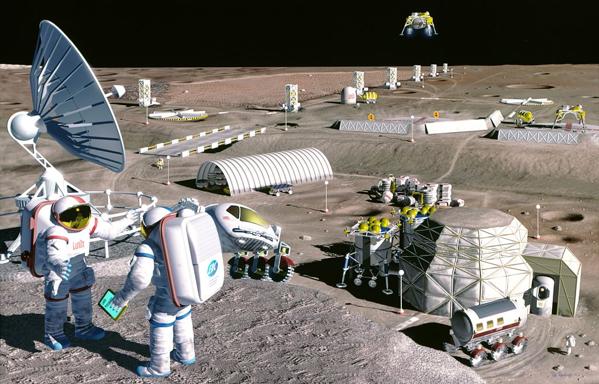
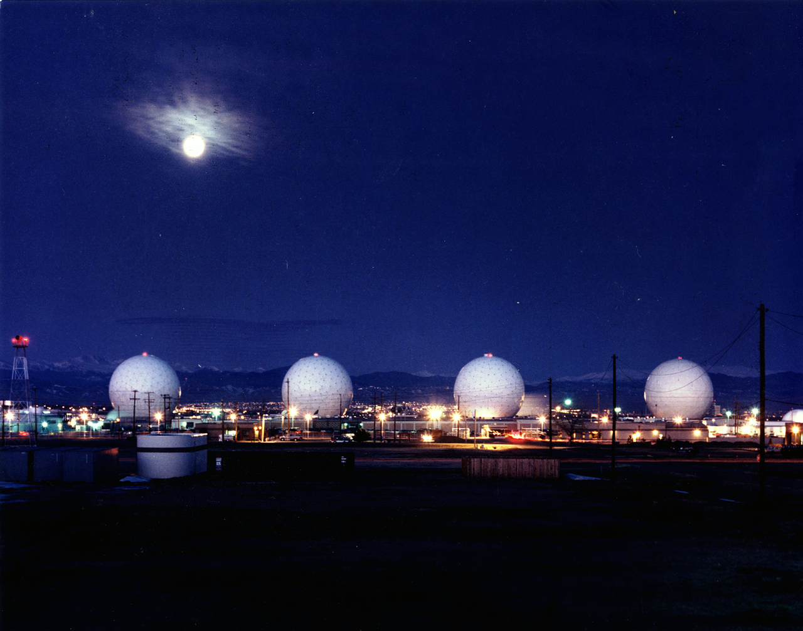

# Moon Race: Exploring Challenges and Opportunities

## Introduction

Numerous nations and private companies have vied for decades to establish a presence on the moon's surface. 

In this article, we will examine the strategic, geopolitical and technological facets of moon exploration and exploitation, as well as the potential benefits and difficulties involved. Examining initiatives by leading nations such as the United States (NASA, Elon Musk), China, Russia and Europe, we will discuss the geopolitical significance of moon exploration and exploitation. 

In addition, we will discuss the economic benefits of colonizing the Earth's natural satellite, including the potential for resource extraction, as well as the difficulties humans face when attempting to establish a presence on the lunar surface. 

Finally, we will examine the moon Agreement of 1979 and the propedeutic nature of moon missions with respect to the advancement of technology and space exploration.

## Extracting Resources from the moon

Critical to the exploration and exploitation of a resource is its extraction. Selene is believed to contain a variety of valuable resources, including helium-3, a rare isotope that could be used as fuel for nuclear fusion reactors, as well as other minerals and metals. 

To extract these resources, several technical obstacles must be surmounted. This includes developing the technology to remotely detect these resources, determining efficient and secure methods to extract them from the lunar surface and transporting them back to Earth. To accomplish this, technologies such as robotics, 3D printing and automation would need to be developed. 

In addition to legal and ethical considerations, the extraction of lunar resources is also affected by other factors. In 1979, for instance, the moon Agreement established the framework for international cooperation in the exploration and exploitation of all celestial bodies. In addition, the agreement established principles for the equitable distribution of benefits derived from these activities and the protection of the lunar environment. 

Despite these obstacles, the potential benefits of resource extraction on the moon are substantial and have motivated numerous nations and corporations to pursue moon exploration and exploitation. The extraction of resources has the potential to advance technology, facilitate the establishment of a permanent human presence on the moon's surface and provide valuable resources for use on Earth and in space.

 <figure>    <figcaption> <small>  Artist's rendering of an envisioned lunar mining facility NASA/SAIC/Pat Rawlings  <a target=_blank  target="_blank" href=https://commons.wikimedia.org/wiki/File:Mooncolony.jpg>source link</a> </small> </figcaption></figure> 

## Economic Benefits of Colonizing the moon

In addition to resource extraction, a permanent human presence on the moon could spur innovation and create new economic opportunities. 

This could include the development of new technologies for resource extraction and the establishment of a lunar tourism industry, among other possibilities. However, the development of a lunar economy is still in its infancy and numerous technical, logistical and economic obstacles must be overcome prior to the full realization of lunar resource extraction and other economic opportunities. 

Despite these obstacles, the potential economic benefits of lunar colonization are substantial and have been a driving force for numerous nations and private organizations to pursue moon exploration and exploitation. Establishing a permanent human presence on the moon and exploiting its resources could have a substantial impact on the global economy and the advancement of technology.

## Technological Challenges Facing Human Colonization of the moon

Significant technological advances are necessary for the successful exploration and exploitation of Earth's natural satellite. To establish a human presence on the lunar surface and extract resources, numerous technical obstacles must be surmounted. Among the foremost technological obstacles involved in moon exploration are:

- Developing spacecraft and habitats that can withstand the lunar environment's extreme conditions.
- Developing systems for transporting people and materials to and from the moon,
- Developing systems for human survival on the surface of the moon.

These difficulties necessitate advancements in fields including propulsion, materials science, life support and robotics, among others. Numerous countries and private entities have invested in the development of technology for moon exploration in recent years, resulting in significant progress in these areas. 

To fully realize the potential of moon exploration and exploitation, however, additional technological advancements will be required to overcome the numerous limitations of current technology. In spite of these obstacles, the technological advancements made in the pursuit of moon exploration have the potential to have far-reaching effects that extend beyond moon exploration. 

The development of new technologies for moon exploration can lead to advancements in materials science, propulsion and robotics, among others and have significant implications for other areas of space exploration as well.

## Strategic and Geopolitical Aspects of moon Exploration

Besides technical difficulties, there are substantial political, economic and logistical obstacles to overcome. 

This includes the coordination of international cooperation, the creation of a legal framework for lunar exploration and exploitation and the creation of a sustainable business model for lunar operations. 

As nations compete to establish a presence on the moon's surface, the exploration and exploitation of the moon have become increasingly important. Exploration of the moon has acquired strategic and geopolitical significance due to the possibility of resource extraction and the advancement of technology. 

In recent years, several leading nations have announced plans to establish a lunar presence. As part of its Artemis program, NASA has plans to return astronauts to the lunar surface by 2024. Elon Musk and SpaceX are also interested in moon exploration, with plans to send humans there as early as 2026. 

China has also announced its intention to establish a lunar presence, with an emphasis on both resource extraction and exploration. 

Russia and Europe have also expressed interest in lunar exploration and missions are planned for the near future. In addition to these initiatives by individual nations, geopolitical strategy also incorporates international cooperation and competition in moon exploration and exploitation. 

Establishing a presence on our natural satellite is viewed by some nations as a way to assert their dominance in space and demonstrate their technological prowess. Cooperation in moon exploration may serve as a means for some to foster international cooperation and reduce geopolitical tensions. Globally, the strategic and geopolitical aspects of moon exploration and exploitation are intricate and multifaceted, with numerous nations and private organizations competing and cooperating to establish a presence on the lunar surface.

## Military Aspects for moon Programs

 <figure>    <figcaption> <small> Buckley AFB RekonDog (talk)  <a target=_blank  target="_blank" href=https://commons.wikimedia.org/wiki/File:Buckley_AFB.png>source link</a> </small> </figcaption></figure> 

Space has become an arena of competition for both prestige and military purposes, with the lunar programs signalling that space will be a key aspect for both advanced technical expertise and military capabilities. 

The moon has become a new frontier for military operations, as the U.S. military plans to extend its reach into space to one day patrol the area around the moon. According to a 2020 memo signed by NASA and the Space Force, a military force may be necessary to protect lines of commerce in the lunar economy, similar to a coast guard for space. The U.S. military is investing in new technologies to build large structures on the lunar surface and is designing a spy satellite to orbit the moon.

China's National Space Administration, a state-owned space corporation, may be plotting to take over the moon as a part of its military space program. China's lunar program is divided into three phases, with the fourth phase potentially being characterized as staying on the moon.

## The Propaedeutic Nature of moon Missions

Missions to the moon serve as a stepping stone to more ambitious space exploration objectives, providing valuable experience and knowledge. They can also advance our understanding of the larger universe and our place within it, as well as lay the groundwork for a more exhaustive exploration of the cosmos. 

Lunar exploration and exploitation have been a source of fascination and inspiration for centuries and they continue to play a significant role in our efforts to explore and comprehend the universe. However, significant obstacles, such as the harsh lunar environment, limited resources, high cost and complex technological and political considerations, must be overcome. 

The moon Agreement of 1979 provides a legal framework for international cooperation and the sustainable exploitation of lunar resources, further emphasizing the importance of moon exploration and exploitation. 

Missions to the moon are integral to our ongoing efforts to expand human civilization into space. They have the potential to explore and utilize space's resources and to expand our understanding of the universe and our place within it. The creation of systems for human survival and resource extraction on the moon can inform and advance the creation of similar systems for use on other celestial bodies. 

In addition, moon missions can shed light on the formation of the Earth and other planets, as well as the early history of our solar system. Missions to the moon serve as a stepping stone to more ambitious objectives and provide invaluable knowledge and experience.

## Conclusion

Exploration and exploitation of the moon have significant geopolitical, economic and technological consequences. 

The moon's resource extraction and establishment of a permanent human presence could have a significant impact on the global economy and the advancement of technology. To realize the full potential of moon exploration, numerous technical, logistical and financial obstacles must be surmounted. 

In addition, moon exploration serves as a stepping stone for more ambitious space exploration goals by providing valuable experience and knowledge. 

As nations and private entities compete and collaborate to establish a presence on the lunar surface, it is crucial to prioritize international cooperation, the development of a legal framework and the creation of sustainable business models for lunar operations. Exploration and exploitation of the moon has the potential to advance our understanding of the universe and our place in it, as well as lay the foundation for the expansion of human civilization into space.

## A few insights

- Spudis, P. D. (2019). The Moon: A critical resource for enabling a sustainable human presence in space. Acta Astronautica, 160, 442-447. doi: 10.1016/j.actaastro.2019.03.040
- Crawford, I. A. (2015). The scientific case for human missions to the Moon. Planetary and Space Science, 107, 3-17. doi: 10.1016/j.pss.2015.01.003
- Crawford, I. A. (2018). The economic and strategic value of lunar resources. Acta Astronautica, 143, 166-172. doi: 10.1016/j.actaastro.2017.11.039
- Gertsch, L. S., & Crawford, I. A. (2018). International cooperation for the exploration and utilization of the Moon. Advances in Space Research, 62(5), 1110-1121. doi: 10.1016/j.asr.2017.12.034
- Sibille, L., & Crawford, I. A. (2020). The potential of the Moon for planetary defense. Acta Astronautica, 170, 389-398. doi: 10.1016/j.actaastro.2020.03.019
- Spudis, P. D. (2021). The Value of the Moon: How to Explore, Live and Prosper in Space Using the Moon's Resources. Smithsonian Books.
- Crawford, I. A. (2016). Moon: An Illustrated History: From Ancient Myths to the Colonies of Tomorrow. Smithsonian Books.
- Schmitt, H. H., & Culbertson, R. (2018). Return to the Moon: Exploration, Enterprise and Energy in the Human Settlement of Space. Springer.
- Lavoie, A. J. (Ed.). (2020). The Moon: Resources, Future Development and Settlement (Vol. 99). Elsevier.

