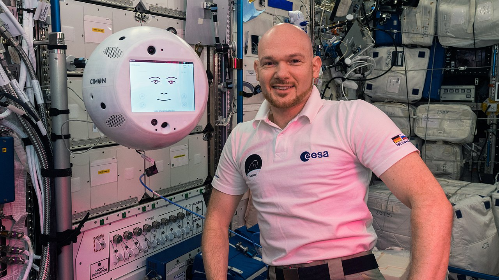
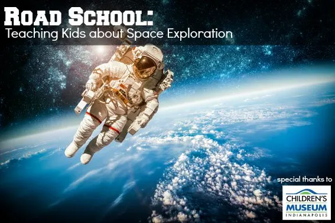

# Role of Artificial Intelligence in Space Exploration

## Introduction

Artificial Intelligence (AI) has become an increasingly important tool in space exploration, extending our reach into the cosmos, enhancing our understanding of the universe, and ensuring the safety and well-being of human spaceflight. From detecting habitable planets to controlling robotic systems, AI is playing an increasingly important role in space exploration, enabling previously impossible discoveries and technologies. In this article, we will examine the various applications of AI in space exploration, the advantages and disadvantages of this technology, and the prospects for the future of space exploration and AI.

## Applications of AI in Space Exploration

Here are some ways that artificial intelligence can be used in space exploration:

- analyzing and interpret massive amounts of data from space telescopes, the International Space Station, and other space research facilities and instruments, resulting in new discoveries and predictions, as well as simulating space environments and conditions.
- enabling autonomous exploration of planets and celestial bodies, and help control and develop robotic systems.
- assisting in the detection and tracking of space debris and the discovery of habitable planets.
- analyzing and interpreting signals from extraterrestrial intelligence.
- enhancing the knowledge discovery and innovation potential of space exploration, by finding new patterns, insights, and solutions from large and complex data sets.

## Enhancing Space Mission Efficiency

 <figure>    <figcaption> <small> ESA astronaut Alexander Gerst with CIMON, an artificial intelligence helper aboard the station. -  -  - <a target=_blank  target="_blank" href=https://www.nasa.gov/mission_pages/station/research/news/SSSH_12nov18>https://www.nasa.gov/mission_pages/station/research/news/SSSH_12nov18</a> </small> </figcaption></figure> 

The following are examples of how artificial intelligence can be used to improve the efficiency of space missions:

- automating routine tasks and optimize performance, leading to more efficient and effective space missions.
- enabling real-time decision-making and risk mitigation, improving the success rate and safety of space missions.
- predicting and modelling space weather, and optimize the performance of propulsion systems and fuel consumption.
- monitoring the health and well-being of astronauts during space missions, and assist in the detection and treatment of medical issues.
- assisting astronauts, planning missions, processing satellite data, tracking space debris, and navigating spacecrafts.
- fostering collaboration and cooperation among different space actors, by facilitating data sharing, communication, and coordination.

## Artificial Intelligence Can Inspire and Educate the Public

 <figure>    <figcaption> <small> Road-School-Teaching-Kids-about-Space-Exploration.jpg.webp  -  -  -  </small> </figcaption></figure> 

This section focuses on the social and cultural impact of artificial intelligence and space exploration, and how they can inspire and educate the public and the next generation of space explorers, such as:

- helping with data analysis and discovery, by using the wealth of ESA and NASA data from all over our Solar System, and finding new patterns, insights, and anomalies that can advance our understanding of space.
- helping with interactive and immersive learning, by creating virtual and augmented reality simulations and games that can engage and inspire the public to learn more about space and its challenges and opportunities.

- augmenting or replacing human competences in various fields, such as engineering, science, medicine, education, and entertainment.

## AI can Pose Some Challenges and Risks for Space Exploration

This list focuses on the potential drawbacks and pitfalls of artificial intelligence and space exploration, and how they need to be addressed and regulated, such as:

- Ethical, legal, social, and technical issues, that may arise from the use or misuse of artificial intelligence in space.
- The need for human oversight, control, and responsibility, to ensure that artificial intelligence is aligned with human values and interests.

 <figure>    <figcaption> <small> "I'm sorry, Dave. I'm afraid I can't do that." HAL 9000 Motivator -  -  - <a target=_blank  target="_blank" href=https://commons.wikimedia.org/wiki/File:HAL9000.svg>https://commons.wikimedia.org/wiki/File:HAL9000.svg</a> </small> </figcaption></figure> 

## Future of AI in Space Exploration

AI has the potential to revolutionize space exploration, enabling missions that were previously impossible.

- Improving the efficiency and safety of space exploration, as well as reducing the costs and risks involved.
- revolutionizing space exploration, enabling missions that were previously impossible.
- assisting in the development of advanced space propulsion systems and new technologies, also for interstellar travel.
- helping predict and mitigate the effects of radiation on spacecraft and human astronauts.
- achieving the long-term goals and visions of space exploration, such as expanding human presence and civilization beyond Earth, and exploring the origins and mysteries of the universe.

## Conclusion

Artificial Intelligence has become an indispensable tool for space exploration, providing new opportunities for scientific discovery, technological innovation, and public participation. By analyzing large data sets, automating routine tasks, and enabling real-time decision-making, artificial intelligence is improving the efficiency and safety of space missions, as well as facilitating collaboration and communication among space actors. However, the use of artificial intelligence in space exploration also poses some ethical, legal, and technical challenges, such as the need for human oversight and control, as well as the potential risks associated with the misuse or malfunction of AI systems. As we continue to explore the reaches of space, it is essential to weigh the benefits and risks of artificial intelligence and to ensure that this technology is consistent with our values, interests, and long-term goals and visions for space exploration.

## A few insights

