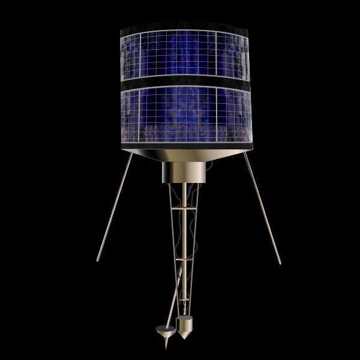
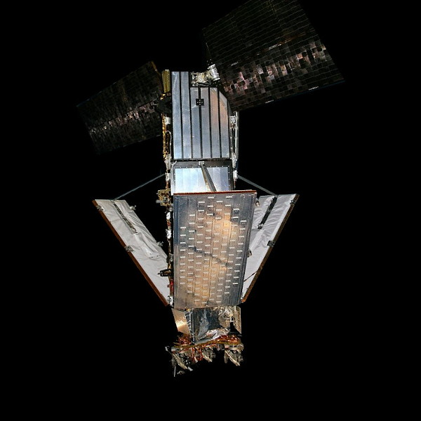
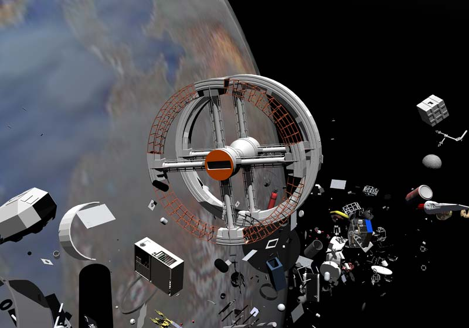
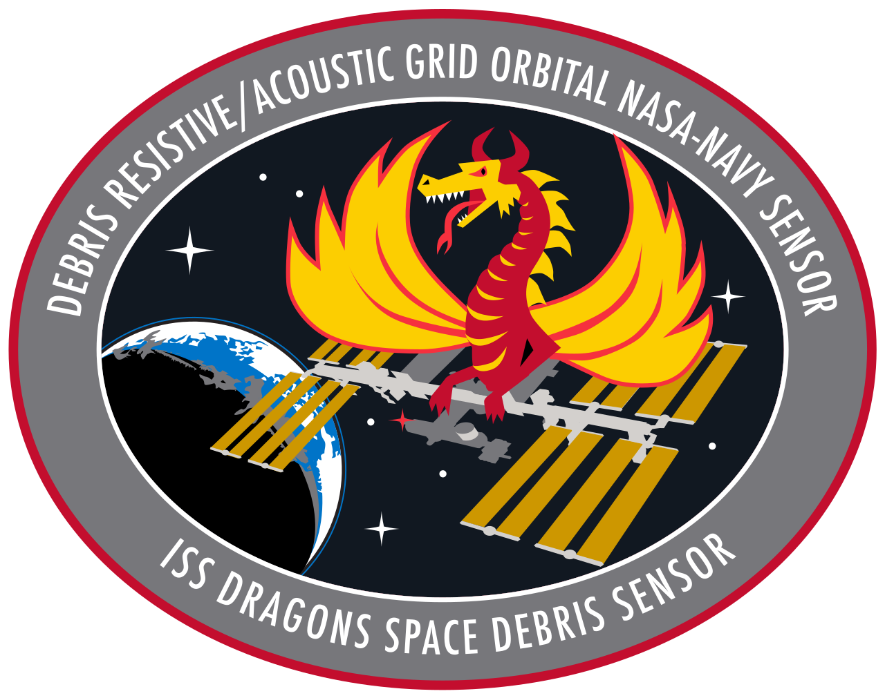

# Space Debris: Threat to Our Space Environment

## Introduction

Space debris is a cloud of discarded objects ranging from small fragments of rocket stages to defunct satellites. It  is a hazard to active satellites and space missions and poses a threat to the future of space exploration.

It all started with the launch of Sputnik in 1957 marking the beginning of the Space Age. Since then we have sent thousands of objects into orbit around the Earth, and many have since ceased to function. These inactive satellites, along with fragments of rocket stages, are now careening through space at incredible speeds, creating a potential danger to any spacecraft or satellite that crosses its path.

As the amount of space debris continues to increase, it becomes increasingly important for us to understand the threat it poses and take measures to mitigate it. The future of space exploration and our reliance on satellite technology demand it. The problem of space debris is complex, but it is one we must address. Failure to do so could lead to a catastrophic chain reaction in space, making it too dangerous for future missions and satellite technology.

## What is Space Debris?

Space debris, also known as space junk or space waste, is any object in orbit around the Earth that is no longer serving a useful purpose. This includes a wide range of objects from tiny fragments of broken-down satellites to entire satellites that have stopped functioning.

There are two main types of space debris: natural debris such as meteoroids and artificial debris, which is created by human activities in space: spent rocket stages, defunct satellites and various other objects that were once part of a space mission.

One of their key characteristics is its size, which can range from tiny fragments just a few millimeters in length to entire satellites that can measure several meters across. Another important characteristic is speed. Objects in space travel at incredible speeds, which can be hazardous if they collide with other objects or spacecraft. Orbital altitude is also a significant factor, as it determines the location of the object in space and its potential for collision with other objects.

Studying space debris is important for several reasons:

- the increasing amount of space junk in orbit around the Earth is a growing concern, as it creates a potential hazard to active satellites and space missions.;
- it is crucial to understand the impact of space debris on our ability to use the  satellites on which we rely in our daily lives;
- future space exploration missions may be impacted by the presence of space junk, and it is important to take measures to mitigate these risks.

In short, understanding space waste is a crucial step towards ensuring the safety and sustainability of our use of space.

## How Did Space Debris Come About?

Space debris is a byproduct of humanity's pursuit of space exploration and the use of satellites for various purposes. Their history  begins with the launch of the first artificial satellite Sputnik by the Soviet Union in 1957. This event marked the start of the Space Age which saw a rapid increase in the number of launches and the deployment of satellites into orbit around the Earth.

With each launch and deployment the amount of artificial space junk in orbit increased. This included spent rocket stages, defunct satellites and other objects that were once part of a space mission. The break-up of satellites due to mechanical failure or collisions with other objects in space also contributed to the rise of artificial space debris.

### Examples of space debris incidents

Some examples are:

- In 2007, China conducted an anti-satellite test that destroyed one of its own weather satellites, and created more than 3,000 pieces of debris, some of which are still in orbit and pose a collision risk.

- In 2009, an operational communications satellite owned by Iridium collided with a defunct Russian military satellite, creating more than 2,000 pieces of debris, some of which damaged other satellites and forced the International Space Station (ISS) to perform avoidance maneuvers.

  |                                      |                     |
  | ------------------------------------------------------------ | ------------------------------------------------------------ |
  | Kosmos 2251 was a 950-kilogram Russian [Strela](https://www.wikiwand.com/en/Strela_satellite) military [communications satellite](https://www.wikiwand.com/en/Communications_satellite) owned by the [Russian Space Forces](https://www.wikiwand.com/en/Russian_Space_Forces). | Iridium 33  was a 560-kilogram US-built  commercial satellite  and was part of the [Iridium constellation](https://www.wikiwand.com/en/Iridium_satellite_constellation). |

- In 2021, a piece of debris from a Chinese rocket that launched a module for its space station reentered the Earth’s atmosphere in an uncontrolled manner, and landed in the Indian Ocean, near the Maldives, after sparking fears and speculations about where it would land.

## Threat Posed by Space Debris

### Dangers posed to active satellites

One of the most significant dangers is the risk of collision with active satellites. These collisions can cause significant damage to the satellites, potentially rendering them useless. The collision risk is particularly high in low Earth orbit, where the majority of artificial space debris is located. This increase in collisions can also degrade the orbits of these satellites, causing them to become less stable over time.

### Economic consequences

Space debris is not only a danger to active satellites but also has severe economic implications for companies and governments. They could face millions in losses if satellites are destroyed by collisions with orbital junk. The need for additional measures to defend against the expense of launching new satellites to replace lost ones can become even more expensive.

### Threat to human spaceflight

Finally, as human flight activities increase, space debris poses a serious threat to human flight: the impact of space debris on spacecrafts can be catastrophic, posing risks to astronauts. It is an important aspect that requires immediate attention in order to ensure the continued safe and successful exploration of space.

 <figure>    <figcaption> <small> SpaceJunk, Miguel Soares, 2001, 3D animation.<a target=_blank  target="_blank" href=https://upload.wikimedia.org/wikipedia/commons/d/d8/S4-space-junk-045.jpg>https://upload.wikimedia.org/wikipedia/commons/d/d8/S4-space-junk-045.jpg</a> </small> </figcaption></figure> 

## Mitigation Strategies

Orbital debris is a real problem for both active satellites and human space travel. The skyrocketing amount of man-made junk in orbit is making it high-time for solutions to be found. Two main categories of solutions exist - active removal and passive measures.

Active removal uses retrieval missions and deorbiting techniques to take big space junk out of orbit. To reduce the danger posed by space debris, a few smart people have come up with some active removal methods. For example, one suggestion is to use a foam-filled balloon to clean up small debris. Another idea is to use space tethers and satellite shielding to protect against larger debris impact. Although these missions can be pricey and complicated, they have the potential to majorly reduce the amount of space junk orbiting us.

Improving shielding and tracking is crucial to minimize the gap between the two approaches. NASA has been looking into various methods of junk removal, including using a dual-wall system to protect space systems. This involves one outer wall breaking up the projectile while many smaller fragments at lower speeds protect the inner wall. Passive measures focus on future junk reduction by designing satellites that can re-enter Earth's atmosphere at the end of their mission and collisions avoidance strategies can be employed.

 <figure>    <figcaption> <small> Space Debris Sensor</small> </figcaption></figure> 

### Regulations and guidelines for satellite manufacturing and launch

To address the challenge of space debris, there are some regulations and guidelines for satellite manufacturing and launch, such as:

- The United Nations’ Space Debris Mitigation Guidelines, which recommend best practices for minimizing the creation and impact of space debris, such as designing satellites for easy disposal, limiting the orbital lifetime of satellites, and avoiding intentional destruction of satellites.
- The Inter-Agency Space Debris Coordination Committee (IADC), which is an international forum of space agencies that exchange information and coordinate activities on space debris research and mitigation, such as conducting debris environment modeling, collision risk assessment, and debris observation and measurement.
- The Space Data Association (SDA), which is a non-profit organization of satellite operators that share data and information on the location and status of satellites and debris, and provide alerts and warnings on potential collisions and conjunctions, as well as support for collision avoidance maneuvers.

## Conclusion

- Space debris is a growing problem that poses a significant threat to exploration and use of space
- Buildup of artificial debris from space launches and satellite breakup is putting active satellites, human spaceflight, and economic interests at risk
- Solutions available to mitigate the problem include:
  - Active measures such as retrieval missions and deorbiting techniques
  - Passive measures such as designing future satellites with debris avoidance in mind
  - International cooperation through agreements and sharing of data and resources
- It is important to take action to address the threat of space debris
- Whether through individual or collective efforts, it is our responsibility to ensure safety and sustainability of space use
- The future of space depends on addressing the issue of space debris.

 <figure>    <figcaption> <small> Space_debris_GIF_ESA380488</a> </small> </figcaption></figure> 

## A few insights

- [Sylvestre, Habimana & Parama, Ramakrishna. (2017). Space debris: Reasons, types, impacts and management. Indian Journal of Radio and Space Physics. 46](https://www.researchgate.net/publication/324161123_Space_debris_Reasons_types_impacts_and_management)
- [Understanding Space Debris Causes, Mitigations, and Issues, Crosslink Fall 2015 Vol. 16 No. 1](https://aerospace.org/sites/default/files/2019-04/Crosslink%20Fall%202015%20V16N1%20.pdf)
- [Dan Oltrogge, Space debris as the backdrop for Space Domain Awareness, COMSPOC Corporation, 20 June 2022](https://www.ucl.ac.uk/research/domains/sites/research_domains/files/20220620_dan_oltrogge_0.pdf)
- [NATIONAL ORBITAL DEBRIS IMPLEMENTATION PLAN (US Office of Science and Technology Policy (OSTP)](https://www.whitehouse.gov/wp-content/uploads/2022/07/07-2022-NATIONAL-ORBITAL-DEBRIS-IMPLEMENTATION-PLAN.pdf)
- [Sherif A. Mostafa, Ahmed Gaber, Farouk El-Baz. SOLID WASTE MANAGEMENT FOR SPACE DEBRIS. Journal of Al-Azhar University Engineering Sector Vol. 17, No. 65, October 2022, 1129 - 1142](https://jaes.journals.ekb.eg/article_265628_281daa0874685959c1a812a3009f9a96.pdf)
- [David S.F. Portree, Joseph P.Loftus, Jr, Orbital Debris: A Chronology, 1999](https://ntrs.nasa.gov/api/citations/19990041784/downloads/19990041784.pdf)
- [ESA SP-1301 Space Debris Mitigation: Implementing Zero Debris Creation Zones, 2005](https://calameodownload.com/read/00053980795432643c499#pages)
- [Limiting Future Collision Risk to SpacecraftAn Assessment of NASA's Meteoroid and Orbital Debris Programs, (2011)](https://nap.nationalacademies.org/read/13244)
- [Joseph N. Pelton, Space Debris and Other Threats from Outer Space, Springer New York, 2013](https://link.springer.com/book/10.1007/978-1-4614-6714-4)
- [Space Debris Peril: Pathways to Opportunities 1st Edition by Matteo Madi -Editor-, Olga Sokolova -Editor- 2021](https://www.taylorfrancis.com/books/edit/10.1201/9781003033899/space-debris-peril-matteo-madi-olga-sokolova)

