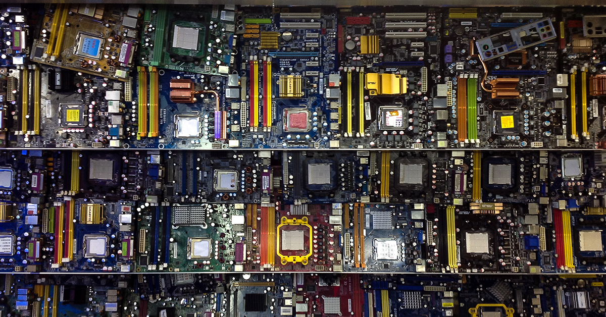
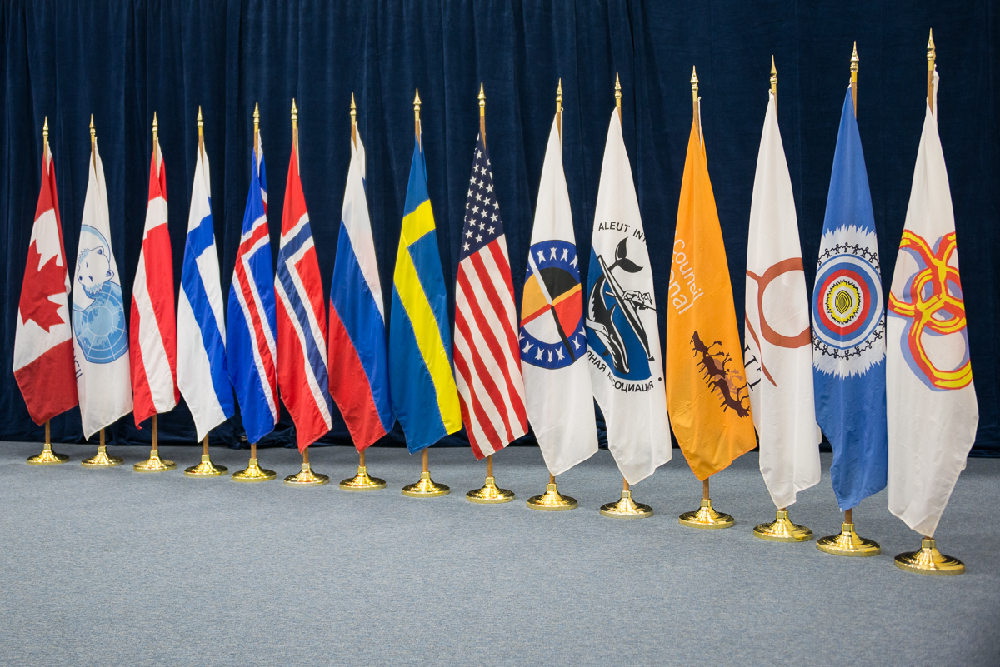
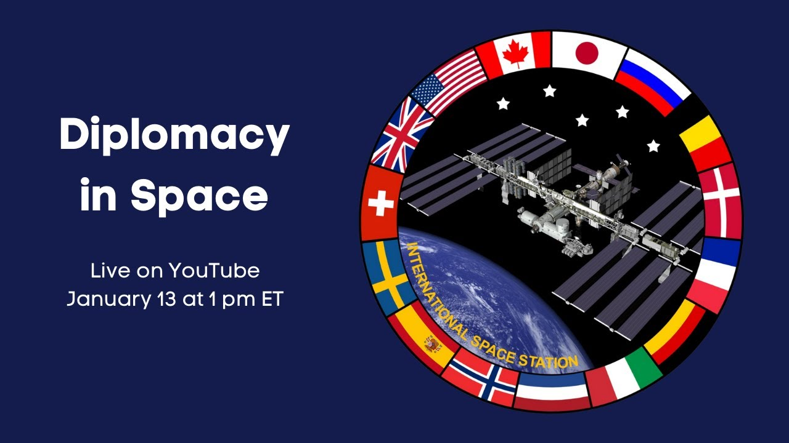

# Space Diplomacy

## Introduction

International initiatives to encourage cooperation and stability in the exploration and use of space are referred to as "space diplomacy (“Space Diplomacy - Wikipedia”) ". The space industry has evolved into a significant sector for both collaboration and competition as a result of increased globalization and technical breakthroughs. International agreements and initiatives provide the legal foundation and promote the peaceful use of space resources. However, striking a balance between the economic, security, and scientific interests in the space sector is a challenging endeavor that necessitates a thorough understanding of the sector and the forces that influence it. Space diplomacy is crucial to the future of the space industry and the assurance of a peaceful and prosperous future for all nations.

## Advancing technology and innovation

Space diplomacy is a challenging area that changes quickly because of the fast pace of technological advancements and the growth of commercial activities in space. Advances in space technology bring new possibilities for exploration, business, and scientific study. However, these advancements also create new issues for international cooperation and diplomacy. One big challenge for space diplomacy today is the increase of commercial interest in the space sector.

Private companies are investing heavily in space technology and driving much of the innovation and growth in the industry. This has led to an increase in the number of countries and private companies participating in space activities, and a growing need for international cooperation and coordination.

### Challenge for space diplomacy

A great challenge facing space diplomacy is the rapid pace of technological advancement. New technologies and capabilities are being developed and deployed at an unprecedented pace, which can lead to new opportunities, but also new risks and challenges. For example, the deployment of large constellations of satellites has raised concerns about the potential for space debris and the need for responsible space operations.

In this context space diplomacy remains an important tool for addressing the challenges posed by rapidly advancing technology and growing commercial interests.

Space diplomacy needs to change quickly and be ready for changes. It needs to understand the technology, the rules, and what's happening in the space field. It also needs to work well with other countries.

## Growing space economy

The space sector is becoming increasingly commercialized, with private companies entering the market and developing new technologies and services. Space technology drives economic growth through satellites and space-based systems.

The multi-billion-dollar satellite industry provides advancements in materials science, computer science, and medicine. Transportation, agriculture, and environmental monitoring widely use space-based navigation and earth observation systems.

The commercialization of space is creating new jobs, businesses, and markets, such as space tourism. 

### Competition and cooperation

Competition in the space industry can encourage innovation and advancement but it can also lead to tensions between countries. Space diplomacy ensures that healthy competition occurs and that governments work cooperatively. It is crucial to accomplish common objectives, balancing international competition with international cooperation. 

This cooperation can take many forms, from joint scientific missions and technology development, to the sharing of satellite data and ground facilities. International cooperation can help reduce costs, share risks and improve the quality of space-related activities.

### Role of space diplomacy

The management of potential conflicts in space is a key function of space diplomacy. For instance, it can assist in:

- regulating the use of satellites and other objects in orbit;
- reducing the risk of object collision or interference;
- preventing the deployment of WMD in space, which could have catastrophic effects on life on Earth.

Space diplomacy can promote the prudent and equitable exploitation of space's resources. For example, the 1967 Outer Space Treaty established the concept of the "shared legacy of mankind". All countries and future generations should take advantage of space resources.

In any case, when it comes to space diplomacy, we must remember that the role and actors of diplomacy have shifted in recent years. Direct communication between heads of state and special envoys is seen in summit diplomacy.  The traditional diplomacy roles are less important in the realm of "high politics", particularly in military security.

## Peaceful exploration and use of outer space

International collaboration is essential for the peaceful exploration and utilization of space. Collaboration across nations enables the exchange of resources, information, and expertise, resulting in more successful and efficient space missions.

The International Space Station (“International Space Station”) (ISS) is a project that is a significant example of how many countries work together. Five space organizations from 15 countries, including NASA and Roscosmos, built the ISS. It's a place where scientists from different countries can work together and test new technologies for space missions.

As the space industry grows and more countries and companies become involved, it's important for everyone to work together to make sure that space stays peaceful and safe. There are potential problems, such as too many satellites being launched into space which could lead to accidents or damage to other space objects. Cooperation among nations is essential to prevent these issues and keep space peaceful.

## International treaties on outer space

International treaties play a crucial role in ensuring responsible behavior in outer space and protecting the interests of all nations. These treaties establish the legal framework for the exploration and use of outer space, and provide a framework for resolving disputes and ensuring the peaceful use of outer space.

### Outer Space Treaty

One of the most important international treaties in the field of space is the Outer Space Treaty (Could not generate citation due to insufficient data) of 1967. The pact prohibits the deployment of weapons of mass destruction in space against satellites or other space objects. The treaty also declares that all countries have an equal right to access and utilize space and its resources which are free for all nations to explore and use. Over 100 countries ratified the treaty, making it one of the most widely supported international treaties in the world.

### Liability Convention 

Another important treaty is the Liability Convention of 1972, which identifies responsibility and provides a framework for compensation in the case of damage caused by space objects.

This treaty helps to ensure that nations are held accountable for their actions in outer space and helps to minimize the risk of conflicts and tensions between nations.

### Other international agreements

Other international agreements help to ensure responsible behavior in outer space, for example:

- the Rescue Agreement of 1968 requires states to provide assistance to astronauts in distress, regardless of their nationality;
- The Registration Convention of 1975 requires states to register all objects launched into outer space, providing greater transparency and accountability in outer space activities.

### The Artemis Accords

The Artemis Accords are a new effort to promote peace and the responsible use of resources in space. These agreements were signed in 2021 by the US and several other countries. The Accords are based on important concepts, including cooperation in space activities, protection of important space locations, and responsible resource use.

However, the Artemis Accords have also been criticized by several countries, namely China and Russia, which have argued that the Accords are an attempt by the United States to dominate and control outer space. They have also criticized the Accords for not being legally binding and for not being inclusive.

Additionally, some experts have raised concerns about the long-term implications of the Artemis Accords. Some have argued that the Accords could lead to an erosion of the principles established by existing international treaties, such as the Outer Space Treaty.

## Balancing economic, security, and scientific interests is key to successful space diplomacy.

Successful space diplomacy depends on striking a balance between commercial, security, and scientific objectives. The sector includes many different activities and goals. It is complex and continuously evolving. It encompasses national security, scientific research, commercial development, and exploration. Balancing these interests is difficult because each of these domains has its own set of objectives, conditions, and difficulties.

- Economic interests in the space sector are growing rapidly, driven by the increasing demand for satellite-based services such as communication, navigation, and remote sensing, as well as the growing commercial space industry.
- Security in space is becoming a concern due to many countries and private companies having access to space capabilities. Space is sometimes used for military and intelligence purposes, which can cause tension and harm the space environment. So, it's important for countries to work together to make space safe and secure.
- Space science helps us learn more about the universe, its beginning and life. Space research also brings scientists from all over the world together to learn about and understand the universe.

 The particular requirements and priorities of each of these sectors must be taken into account for space diplomacy to be successful. In order to accomplish shared objectives, it must simultaneously encourage international collaboration and cooperation.

## Conclusions

- Space diplomacy plays a crucial role in shaping the future of the space sector.
- It balances the competing interests of nations and promotes cooperation and stability.
- International treaties and initiatives, such as the Artemis Accords, provide a legal framework and guidelines for the peaceful and sustainable use of space resources.
- Space diplomacy must keep pace with rapidly advancing technology and growing commercial interests.
- Balancing economic, security, and scientific interests is key to successful space diplomacy.
- It requires a deep understanding of unique needs and priorities of different stakeholders in the space sector.
- Space diplomacy ensures that the exploration and use of outer space benefits all nations and contributes to a peaceful and prosperous future for humanity.

## A few insights

>“Space Diplomacy - Wikipedia.” *Space Diplomacy - Wikipedia*, 21 Apr. 2021, en.wikipedia.org/wiki/Space_diplomacy.

>“International Space Station.” *NASA*, www.nasa.gov/mission_pages/station/main/index.html. Accessed 2 Feb. 2023.

>robert.wickramatunga. “The Outer Space Treaty.” *The Outer Space Treaty*, 31 Jan. 2023, www.unoosa.org/oosa/en/ourwork/spacelaw/treaties/introouterspacetreaty.html.

>robert.wickramatunga. “Liability Convention.” *Liability Convention*, 31 Jan. 2023, www.unoosa.org/oosa/en/ourwork/spacelaw/treaties/liability-convention.html.

>robert.wickramatunga. “Rescue Agreement.” *Rescue Agreement*, 31 Jan. 2023, www.unoosa.org/oosa/en/ourwork/spacelaw/treaties/rescueagreement.html.

>robert.wickramatunga. “Registration Convention.” *Registration Convention*, 31 Jan. 2023, www.unoosa.org/oosa/en/ourwork/spacelaw/treaties/introregistration-convention.html.

>“Artemis Accords - Wikipedia.” *Artemis Accords - Wikipedia*, 10 Dec. 2021, en.wikipedia.org/wiki/Artemis_Accords.

>“The Role of Diplomacy in Keeping Outer Space Safe, Secure, and Sustainable.” *U.S. Department of State*, 14 Apr. 2016, //2009-2017.state.gov/t/avc/rls/255834.htm.

>*https://www.tandfonline.com/doi/abs/10.1080/1477-760391832516*. www.tandfonline.com/doi/abs/10.1080/1477-760391832516. Accessed 2 Feb. 2023.

