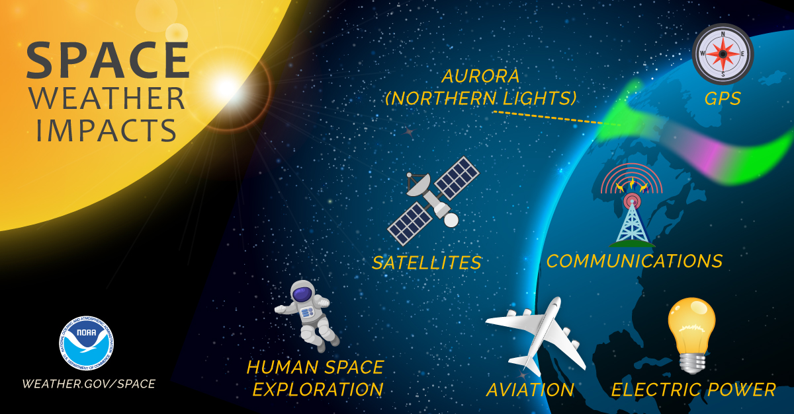
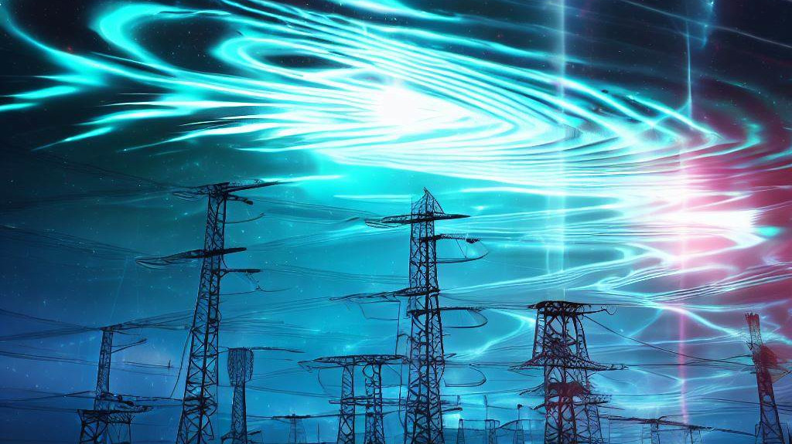

# Space Weather: What It Is, Why It Matters, and How to Deal With It

## Introduction

> Space weather: a powerful force that shapes our technological world.
> 

Space weather is a natural phenomenon that can have significant impacts on Earth's technological systems, including power grids, communication networks, and navigation systems. Understanding and predicting space weather is crucial for mitigating risks and maximizing the benefits of space-based technologies. In this context, international organizations, governments, and agencies are working together to develop strategies to protect and prepare for space weather events, while also exploiting the opportunities that space weather presents.

## What is space weather and how does it originate from the Sun?
> Space weather is driven by the activity of the Sun ( [Space weather: The solar perspective](https://doi.org/10.12942/lrsp-2006-2) ), which constantly emits streams of charged particles and electromagnetic radiation. Sometimes, the Sun produces intense bursts of energy called solar flares and coronal mass ejections (CMEs), which can cause major disturbances in the interplanetary medium.
- **Solar Flares**: Solar flares are sudden bursts of energy that occur when magnetic fields on the Sun's surface break and reconnect. These events release a tremendous amount of energy in the form of light and heat, and they can generate intense bursts of X-rays and ultraviolet radiation. In fact, a single solar flare can release as much energy as billions of hydrogen bombs in a matter of minutes. Solar flares are classified into different categories based on their X-ray intensity, with the most powerful flares being classified as X-class flares. When directed towards Earth, solar flares can cause a number of space weather effects, including radio blackouts, geomagnetic storms, and even damage to satellites and other spacecraft.
- **Coronal Mass Ejections (CMEs)**: CMEs are massive clouds of plasma that are ejected from the Sun's corona at high speeds, typically several hundred to several thousand kilometers per second. These events can carry up to 10 billion tons of material and create shock waves that propagate through the solar wind. When a CME is directed towards Earth, it can cause a number of space weather effects, including geomagnetic storms and auroras. In addition, the fast-moving plasma can interact with Earth's magnetic field, causing electrical currents that can damage power grids and other technological systems.
- **Interplanetary Magnetic Field (IMF)**: The IMF is a magnetic field that is carried by the solar wind. It is turbulent and variable, and it can interact with Earth's magnetic field in a number of ways. When the IMF is oriented in a southward direction, it can allow solar wind particles to enter the Earth's magnetosphere, leading to geomagnetic storms and other space weather effects. In addition, the IMF can compress the magnetosphere and cause it to vibrate, leading to a phenomenon known as magnetic reconnection.
- **Solar Wind**: The solar wind is a stream of charged particles that is constantly blowing out from the Sun. It is made up of protons, electrons, and other particles, and it can interact with Earth's magnetic field in a number of ways. When the solar wind is particularly strong, it can cause geomagnetic storms and other space weather effects. In addition, the solar wind can strip away the Earth's atmosphere, leading to the loss of atmospheric gases such as hydrogen and helium.
- **Solar Radiation**: The Sun emits a wide range of electromagnetic radiation, including X-rays, ultraviolet radiation, and visible light. This radiation can interact with the Earth's atmosphere, causing ionization and other effects. In addition, the radiation can pose a hazard to astronauts and other space travelers, as it can cause damage to DNA and other biological molecules.

## How does space weather impact our planet and our society?

> Space weather can have negative effects on our planet and our society ([Space weather effects on technologies](https://agupubs.onlinelibrary.wiley.com/doi/pdfdirect/10.1029/GM125p0011)). Some of the most common impacts are:
- **Geomagnetic storms**: Geomagnetic storms are disturbances in the Earth's magnetic field caused by the arrival of CMEs or high-speed solar wind streams. These storms can induce electric currents in power grids, pipelines, railways, and other infrastructure, causing damage or disruption. The induced currents can also overload transformers and other equipment, leading to blackouts and other power outages. In addition, geomagnetic storms can affect navigation systems such as GPS and compasses by causing errors in the positioning and timing signals.
- **Ionospheric disturbances**: Ionospheric disturbances are changes in the density and structure of the ionosphere, which is a layer of electrically charged particles in the upper atmosphere. These disturbances can affect radio communication, especially at high frequencies, by causing signal fading, distortion, or reflection. They can also interfere with radar systems and satellite signals, leading to errors in navigation and communication. In addition, ionospheric disturbances can affect the accuracy of space-based observations and measurements, such as those used for weather forecasting and climate monitoring.
- **Radiation hazards**: Space weather can pose a radiation hazard to astronauts and other space travelers, as well as to aircraft crews and high-altitude passengers. Solar radiation can cause skin cancer, cataracts, and other health problems, as well as damage to electronic equipment and materials. In addition, radiation can cause disruptions or failures in satellite and other space-based systems, leading to loss of communication, navigation, or remote sensing capabilities.
- **Commercial impacts**: Space weather can also have significant commercial impacts, especially in industries that depend on satellite-based services and technologies. For example, disruptions or failures in GPS or communication satellites can affect transportation, logistics, and financial services, causing delays and losses. In addition, space weather can affect the performance and reliability of satellite-based Earth observation and remote sensing systems, leading to errors or biases in data analysis and interpretation.

## How do we observe and predict space weather events?
> Space weather is a complex and dynamic phenomenon that requires sophisticated instruments and models to monitor and forecast ([Studying Space Weather](https://www.nasa.gov/spaceweather/)) . There are several sources of data and information that we can use to understand and anticipate space weather events.
- **Space-based observatories**: Space-based observatories can provide continuous measurements of the solar activity, the interplanetary medium, and the geospace environment. These satellites orbit the Earth or the Sun and can provide valuable information on the solar wind, solar flares, and coronal mass ejections. Some examples of space-based observatories include:
  - Solar and Heliospheric Observatory (SOHO)
  - Advanced Composition Explorer (ACE)
  - Solar Terrestrial Relations Observatory (STEREO)
  - Solar Dynamics Observatory (SDO)
  - Geostationary Operational Environmental Satellite (GOES)
  - Swarm

- **Ground-based observatories**: Ground-based observatories can measure the magnetic field, the ionosphere, and the cosmic rays on the Earth's surface or in the near-space. These observatories can provide complementary data to space-based observatories and help us understand the interaction between the solar wind and the Earth's environment. Ground-based observatories are equipped with many instruments, like magnetometers, ionosondes, radars, neutron monitors.

- **Numerical models**: Numerical models are computer simulations that use physical equations and empirical relationships to describe the behavior of the solar system and its components. These models can help us understand the causes and effects of space weather events and provide forecasts of future scenarios. Some examples of numerical models are:
  - ENLIL: This model simulates the propagation of coronal mass ejections in the solar wind and can provide forecasts of the arrival time and intensity of the disturbances at the Earth's orbit.
  - WSA: This model simulates the solar wind and the interaction between the solar wind and the Earth's magnetic field, and can provide forecasts of the geomagnetic activity and the auroral activity.

## How can we mitigate the risks of space weather?
> Space weather can pose significant challenges for various sectors and domains that depend on or utilize space technology. Therefore, it is important to develop strategies and solutions that can reduce the vulnerability and increase the resilience of our systems and services to space weather hazards.([A risk assessment framework for the socio-economic impacts of electricity transmission infrastructure failure due to space weather: An application to the United Kingdom](https://doi.org/10.1111/risa.13229))
- **Protection**: Protecting our systems and infrastructure from the impacts of space weather involves designing and building technologies that are resilient to space weather events. Spacecraft can be shielded from radiation using materials such as aluminum or polyethylene, while power grids can be hardened to withstand geomagnetic currents that can cause blackouts. Backup communication systems can be put in place to ensure that critical communications can still take place during a space weather event.
- **Preparedness**: Being prepared for space weather events involves developing and implementing plans and procedures that can help us respond to and recover from these events. This includes issuing alerts and warnings to relevant stakeholders, coordinating emergency actions, and restoring normal operations as soon as possible. For example, power grid operators can take proactive measures such as reducing the load on the grid during a geomagnetic storm, while astronauts on the International Space Station can shelter in designated safe areas to minimize their exposure to radiation.
- **Research and Development**: Continued research and development in space weather prediction and forecasting is critical to improving our ability to mitigate the risks of space weather. This includes developing more accurate models of space weather phenomena, improving our understanding of the Sun-Earth system, and developing new technologies and approaches to protect our systems and infrastructure. 

## Who are the main authorities and entities that deal with space weather?

> Space weather is a multidisciplinary and cross-sectoral issue that involves various authorities and entities at different levels and domains ([Space Weather Operations, Research and Mitigation Activity](https://www.sworm.gov/)).
- **International organizations**: These are bodies that facilitate and coordinate the global cooperation and governance of space weather. For example, the United Nations (UN), the World Meteorological Organization (WMO), the International Civil Aviation Organization (ICAO), and the International Telecommunication Union (ITU).
- **National agencies**: These are institutions that provide and regulate the space weather services and activities in their respective countries. For example, the National Oceanic and Atmospheric Administration (NOAA), the European Space Agency (ESA), the Japan Aerospace Exploration Agency (JAXA), and the China National Space Administration (CNSA).
- **Sectoral operators**: These are entities that operate and manage the systems and infrastructure that are affected by or utilize space weather. For example, power companies, telecommunication providers, airlines, satellite operators, and military forces.
- **Scientific communities**: These are groups of researchers and experts that conduct and disseminate the scientific knowledge and innovation on space weather. For example, universities, research institutes, journals, conferences, and networks.

## What are the current and future trends in space weather research and innovation?
> Space weather is a rapidly evolving field that offers many challenges and opportunities for research and innovation. Some of the current and future trends are:
- **Increasing awareness and collaboration**: Space weather is becoming more recognized and appreciated as a global issue that affects many aspects of our society. Therefore, there is a growing need and interest for international cooperation and coordination among various stakeholders, such as scientists, engineers, policymakers, operators, users, educators, and public.
- **Improving data and models**: Space weather relies on high-quality data and models to provide accurate and reliable information and forecasts. Therefore, there is a continuous effort to improve the quantity and quality of observations from space-based and ground-based instruments, as well as to develop more advanced and realistic numerical models that can capture the complexity and variability of space weather phenomena.
- **Developing new applications and services**: Space weather offers many possibilities for developing new applications and services that can benefit various sectors and domains. Therefore, there is a constant demand for innovation
