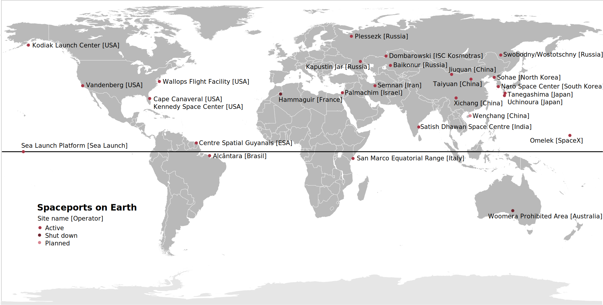
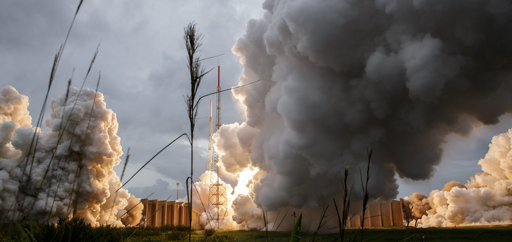
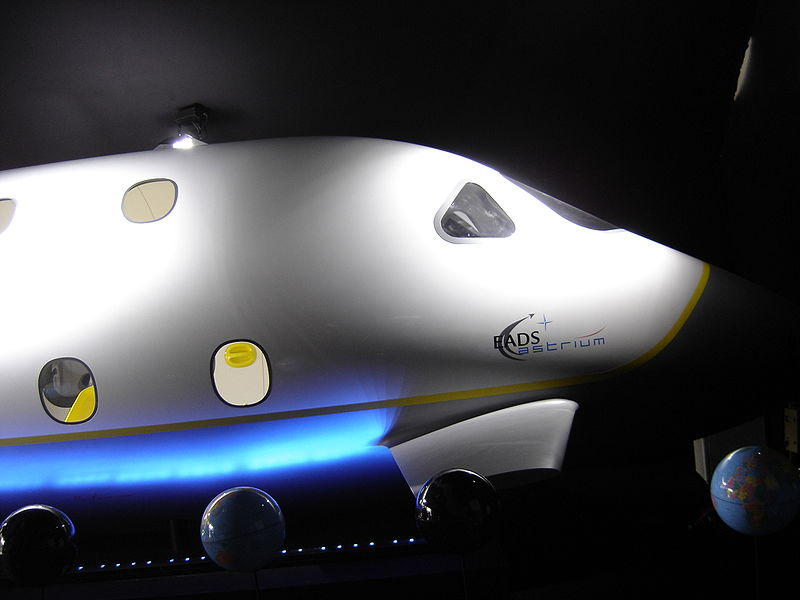
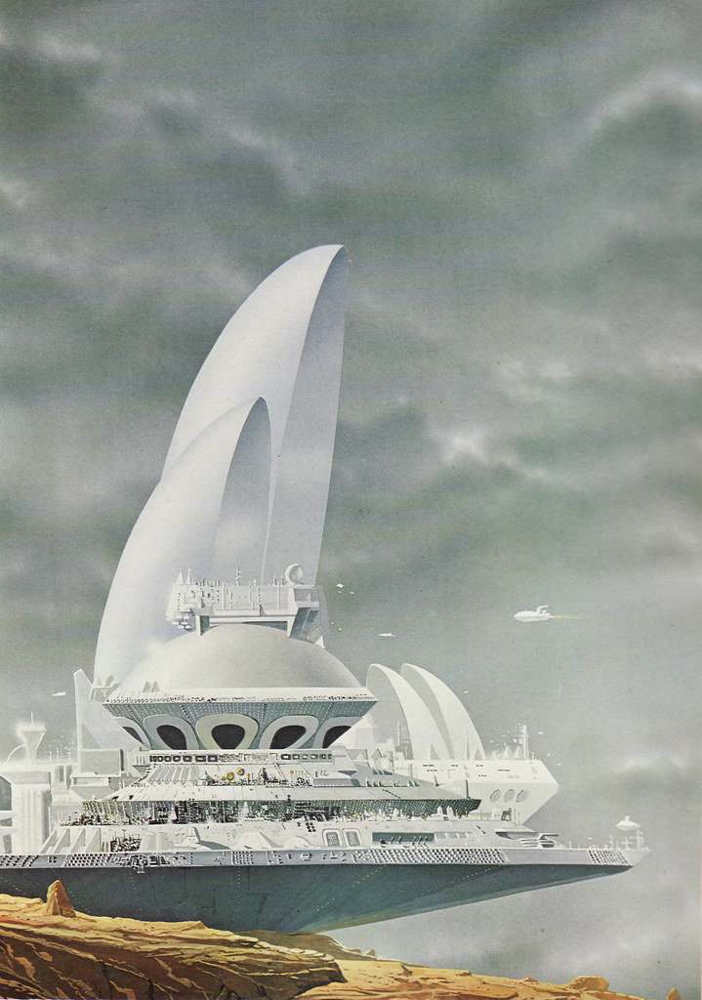

# Spaceports in Space Exploration

## Introduction

Spaceports are facilities intended for launching, landing, and servicing spacecraft. They typically include a runway, launch pads, mission control centers, and other necessary infrastructure for spacecraft operation. They serve as storage and maintenance sites for spacecraft, offering a secure environment for astronauts and personnel to train and prepare for space missions.  

As space exploration progresses, spaceports' significance amplifies. They've been a vital aspect of space technology and exploration development, from the earliest days of space travel until today. This post delves into the history of spaceports, their role in space exploration currently, and the difficulties in constructing and maintaining them. It also examines spaceports' potential economic impact and speculates on what the future holds for them. By the end, you'll have a clearer comprehension of spaceports' importance and their role in space exploration.

## Overview of Spaceports' History

The history of spaceports dates back to 1957 with the creation of the first one at Baikonur Cosmodrome in Kazakhstan used to launch Sputnik 1. Since then, spaceports have been the launch site of numerous spacecraft, including Apollo missions, Space Shuttle, and ISS. They also serve as landing sites for Space Shuttle and Soyuz capsules, and launch and landing sites for unmanned spacecraft like Mars rovers. In recent times, private companies like SpaceX and Blue Origin have boosted the significance of spaceports as they launch and land their own spacecraft. Spaceports have become a crucial part of the space industry, providing a secure platform for spacecraft operations.

## Role of Spaceports

### Launch Sites for Space Exploration

Spaceports are facilities used for launching satellites, probes and manned spacecraft. They are often located in remote areas away from populated regions and utilize complex infrastructure and equipment. Launch sites typically include a launchpad, a launch tower, a control center, and various support facilities. Launch sites are therefore an indispensable component for space exploration.

### Research and Development Hubs

Research and development hubs are organizations that support and provide resources for R&D activities. Established by governments, universities, or private companies, they foster the development of new technologies and products. They offer access to specialized equipment, expertise, and resources not readily available in the general market and provide a platform for collaboration between researchers, industry, and government. They often fund research projects and provide access to venture capital and other forms of financing.

## Challenges facing Spaceports

### Cost of construction and maintenance

The cost of building and maintaining a spaceport is significant and must be carefully considered to ensure that it is sustainable over the long term. Factors contributing to the cost of construction and maintenance include the cost of materials, labor, and equipment. Additional costs are represented by the provision of the necessary infrastructure and services for spacecraft operation. Then there is the cost of training ground and support personnel as well as astronauts and the development and maintenance of the technological devices that allow the spaceport to operate.

### Environmental impact

The environmental impact of spaceports must also be considered. Spaceports can have a significant impact on the environment both in terms of the direct impact of the construction and operation of the facility, as well as the indirect impact of the activities it supports. Factors that can impact the environment include air and water pollution, soil erosion, and the loss of wildlife habitats. It is important to carefully consider the environmental impact of spaceports, and to take steps to minimize their impact wherever possible.

### Technical challenges

The development and operation of spaceports also presents a range of technical challenges. Spaceports facilities must be designed and built to deal with equipment intended to endure the extreme conditions of space. They must be equipped as well as to provide the necessary communication and control systems to support their operation.

### Safety & Security

The safety and security of spaceport operations is of utmost importance. Spaceports must comply with strict safety and security regulations, including emergency procedures, access control and fire safety. Spaceports must also have the capability to respond to potential security threats and natural disasters.

### Competition for resources

Spaceports must compete with other infrastructure projects for limited resources, including funding, personnel and materials. This can make it difficult to build and maintain spaceports especially in countries with limited resources. It is important for spaceports to be strategic in their approach to resource allocation, and to seek partnerships and collaborations with other organizations and governments to maximize their impact.

## Potential economic impact of spaceports

### Boosting local and regional economies

The development and operation of spaceports can have a significant economic impact both locally and regionally. For example the construction and operation of spaceports can create jobs and stimulate economic growth, as well as increase local and regional investment. Additionally, spaceports can provide opportunities for companies and researchers to develop new technologies and products, as well as to explore new markets and opportunities.

### Encouraging space tourism

The growth of space tourism represents a significant opportunity for spaceports to diversify their revenue streams. As more people become interested in space travel, spaceports can position themselves as a hub for space tourism providing facilities and services to support the growth of this industry.

## The future of spaceports

Spaceports' future will be influenced by factors like space exploration growth and tech development. Private space companies and space tourism growth will drive spaceport investment. Advances in space technology will offer new opportunities for spaceport expansion. 

---
---
# Some idea on plots

- 
  Geographical Distribution of Spaceports: Create a world map to visualize the location and distribution of spaceports across the globe.

- Growth of Spaceports Over Time: Plot the number of spaceports built over time to show the growth and evolution of the industry.

- Spacecraft Launches by Spaceport: Create a bar graph to compare the number of launches made by each spaceport, highlighting the busiest spaceports in terms of launches.

- Spending on Spaceports: Plot the total budget allocated for spaceport construction and maintenance over time to show how much resources are invested in the industry.

- Types of Spacecraft Launched: Create a pie chart to visualize the distribution of different types of spacecraft launched from spaceports (e.g. satellites, crewed spacecraft, cargo ships, etc.).

- Mission Control Centers: Plot the number of mission control centers located at spaceports, highlighting the importance of these facilities in the success of space missions.

- Time-series analysis of launches per spaceport, showing trends and fluctuations.

- A map of the world showing the locations of major spaceports and the countries that operate them.

- A bar graph comparing the number of launches from different spaceports, highlighting the most active facilities.

- A pie chart showing the distribution of launches by different types of spacecraft (e.g. crewed, uncrewed, cargo, etc.).

- A histogram showing the frequency of launches at different times of the year, to illustrate peak activity periods.

## A few insights

