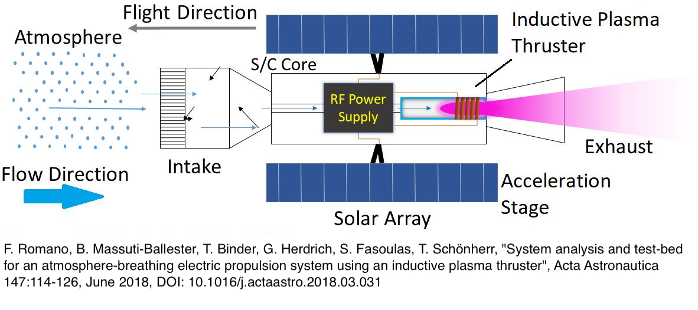
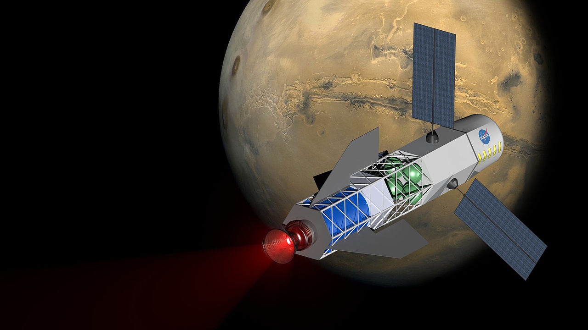
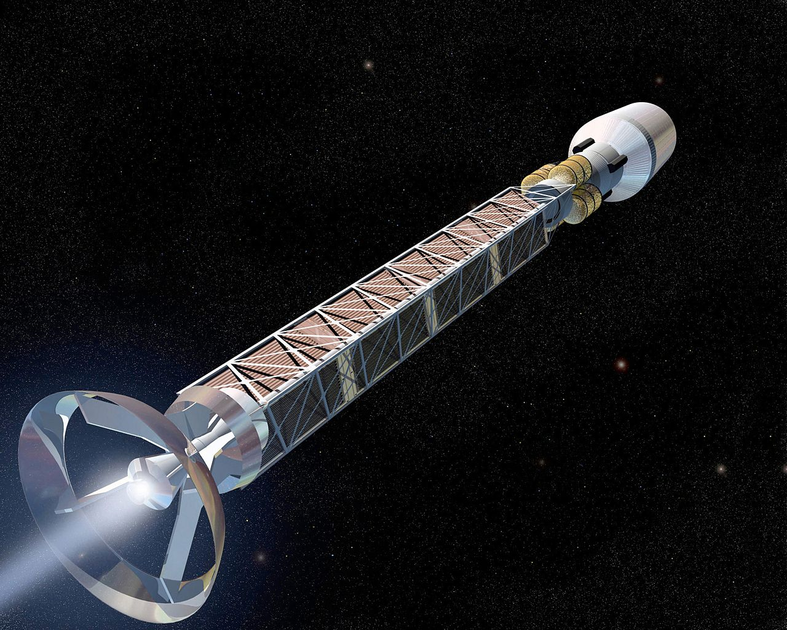

# The Future of Space Travel: Advancements in Propulsion Technology

## Introduction

Propulsion technology is critical to space travel, powering rockets and spacecraft as they journey through space. However, current propulsion technologies have limitations that make interplanetary and interstellar travel difficult and costly. Fortunately, advancements in propulsion technology could significantly enhance space travel capabilities, making space exploration more accessible and efficient. In this post, we'll look at some current and future propulsion technologies that could change the way people travel to space.

## Electric Propulsion

Electric propulsion is a form of propulsion in which electric power is used to accelerate propellant particles and generate thrust.
Electric propulsion is more efficient and provides longer-lasting thrust than chemical rockets, making it ideal for long-duration missions. However, electric propulsion has limitations, such as lower thrust levels, which can reduce its effectiveness for launch applications. Scientists are looking into new ways to move spacecraft, such as ion engines, Hall thrusters, and pulsed plasma thrusters, to get around these problems.

- Ion engines are a form of electric propulsion that generate thrust by accelerating ions. They function by ionizing a gas, typically xenon, and using an electric field to accelerate the ions out of the engine. This generates a very low but constant thrust that can be maintained for extended periods, making it ideal for deep space missions.
- Hall thrusters are an additional form of electric propulsion that utilizes a magnetic field to accelerate ions. They can produce higher thrust levels than ion engines and are more efficient at higher power levels, but they are more difficult to operate.
- A third type of electric propulsion, pulsed plasma thrusters, use a series of high-powered electrical pulses to ionize a gas and generate thrust. Although they can generate greater thrust levels than ion engines, they are less efficient and have shorter lifespans.

 <figure>    <figcaption> <small> ABEP_Concept.jpg Concept of an Atmosphere-Breathing Electric Propulsion System - Endeavour88 -  - <a target=_blank  target="_blank" href=https://commons.wikimedia.org/wiki/File:ABEP_Concept.jpg>https://commons.wikimedia.org/wiki/File:ABEP_Concept.jpg</a> </small> </figcaption></figure> 

Ongoing research aims to enhance the performance and efficiency of electric propulsion systems. The development of new propellants with a higher specific impulse, a measure of the efficiency of a propulsion system, is one area of emphasis. Improving the durability and longevity of electric propulsion systems is another area of research, as many of these systems have limited lifetimes due to factors like erosion and contamination. Electric propulsion has become an increasingly popular technology in recent years, despite its challenges. In fact, the vast majority of scientific spacecraft currently in orbit use some form of electric propulsion, and electric propulsion is already anticipated in the development of deep space exploration vehicles such as NASA's Orion spacecraft, which is designed to transport astronauts to the Moon and beyond.

## Nuclear Propulsion

Nuclear propulsion presents an extraordinary opportunity to increase the speed and range of space exploration beyond what is possible with conventional propulsion systems. In contrast to conventional rockets, which rely on the combustion of chemical fuels to produce thrust, nuclear propulsion uses the energy released by nuclear reactions to heat a propellant and generate thrust. This technology has been studied and tested for decades, and many ideas for nuclear propulsion have been put forward, such as nuclear thermal rockets, nuclear pulse propulsion, and electric nuclear propulsion.

 <figure>    <figcaption> <small> 1280px-The_Fusion_Driven_Rocket_powered_spacecraft.jpg A concept image of a spacecraft powered by a fusion-driven rocket. In this image, the crew would be in the forward-most chamber. Solar panels on the sides would collect energy to initiate the process that creates fusion. -  -  - <a target=_blank  target="_blank" href=https://commons.wikimedia.org/wiki/File:The_Fusion_Driven_Rocket_powered_spacecraft.jpg>https://commons.wikimedia.org/wiki/File:The_Fusion_Driven_Rocket_powered_spacecraft.jpg</a> </small> </figcaption></figure> 

- Fusion propulsion is a promising nuclear propulsion concept that would generate energy by fusing atomic nuclei together, similar to how the sun generates energy. Fusion reactions produce far less radioactive waste than nuclear fission, the process used in nuclear reactors on Earth, and release significantly more energy. But keeping fusion reactions going on a spacecraft is a big technical challenge, and developing the technology needed to do it takes a lot of money and research.
- Fission reactors, which use the energy released by splitting atomic nuclei to heat a propellant and generate thrust, are another nuclear propulsion concept. For example, nuclear thermal rockets would employ a fission reactor to heat hydrogen propellant, which would then be expelled through a nozzle to generate thrust. This technology has already been looked at. It has more thrust and specific impulse than chemical rockets, but it also has a lot of technical and safety problems.

Using nuclear power in space, for instance, necessitates the development of radiation shielding and safety measures to protect the crew and spacecraft from the dangers of ionizing radiation. As with electric propulsion, the development and use of nuclear propulsion technology present economic and political challenges. The cost and availability of nuclear materials, as well as concerns regarding nuclear proliferation and weaponization, are among these obstacles. In spite of these obstacles, nuclear propulsion technology has the potential to enable faster and more efficient space travel, and continued research and investment in this field could result in significant future advances.

## Antimatter propulsion

Antimatter propulsion is another emerging technology that involves using the annihilation of matter and antimatter to generate thrust.
Antimatter is a type of particle that has the same mass as ordinary matter, but has an opposite charge. When antimatter and matter come into contact, they annihilate each other, releasing energy in the process. This energy can be used to create thrust for a spacecraft. Antimatter propulsion has the potential to provide even greater speed and efficiency than fusion propulsion, but it is also much more challenging to develop. One of the main challenges is producing and storing large quantities of antimatter, which is extremely rare and difficult to create. Another challenge is developing a propulsion system that can harness the energy released by antimatter annihilation and convert it into usable thrust.

 <figure>    <figcaption> <small> 1280px-Antimatter_Rocket.jpg This is an artist's rendition of an antimatter propulsion system. Matter - antimatter arnihilation offers the highest possible physical energy density of any known reaction substance. - NASA/MSFC -  - <a target=_blank  target="_blank" href=http://mix.msfc.nasa.gov/abstracts.php?p=577>http://mix.msfc.nasa.gov/abstracts.php?p=577</a> </small> </figcaption></figure> 

## Development and Applications

Developing advanced propulsion technologies requires significant investment and research. This investment is necessary to address technical challenges and safety concerns, and to test and refine new concepts. Space agencies, private companies, and academic institutions all play a role in pursuing research and development in advanced propulsion technologies. By working together, they can accelerate progress and bring new technologies to maturity.

Advancements in propulsion technology have implications for a range of industries and applications. For example, the design and construction of spacecraft may need to be rethought to take advantage of new propulsion technologies. Additionally, advanced propulsion technologies can enable new types of space missions, such as faster travel to Mars and the outer solar system, and even interstellar travel. These technologies also have the potential to reduce travel times, lower costs, and increase safety, enhancing scientific discovery and exploration. However, the use of advanced propulsion technologies raises ethical and regulatory considerations, such as their potential environmental impact and weaponization.

 

## Conclusion

 

Advancements in propulsion technology have the potential to revolutionize space travel, making it more accessible, efficient, and safe. Electric and nuclear propulsion, as well as emerging technologies like fusion and antimatter propulsion, offer significant advantages over current propulsion technologies. To realize these benefits, continued investment and research in advanced propulsion technologies are needed. As we continue to explore the cosmos, it is essential that we continue to innovate and push the boundaries of propulsion technology to unlock the full potential of space travel.

## A few insights

[GO: Advanced Propulsion - NASA Space Technology Mission Directorate - March 2022](https://techport.nasa.gov/file/142854)

[GO: Space Nuclear Propulsion - NASA Space Technology Mission Directorate - March 2](https://techport.nasa.gov/file/142857)

[Benjamin, & Alec. (2020). *Aerospace 7 no*.](https://www.mdpi.com/2226-4310/7/9/120)

[Roger, & S. (2021). *NASEM Space Nuclear Propulsion Technologies Committee Report*.](https://www.researchgate.net/publication/349379840_Space_Nuclear_Propulsion_for_Human_Mars_Exploration_NASEM_Space_Nuclear_Propulsion_Technologies_Committee_Report_released_02-12-2021_httpsdoiorg101722625977)

[Jackson. (2022). *Nuclear Technology 208 no*.](https://www.tandfonline.com/doi/full/10.1080/00295450.2021.1997057?tab=permissions&scroll=top)
