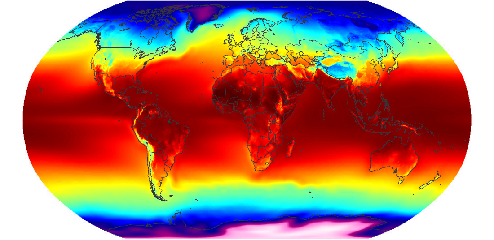

# 

 <figure>    <figcaption> <small>     </small> </figcaption></figure> 

## The SATDH site.
Welcome to the satdh.com blog on space strategy, systems, and technologies! We are a group of space enthusiasts and experts who are interested in learning about the most recent advancements in this field. Our blog is dedicated to providing valuable insights, updates, and information about space strategy, systems, and technologies.
You'll find a wide range of topics covered here, from the most recent space missions and innovations to in-depth analyses of current and future space industry trends. We aim to make our content accessible to readers with varying levels of knowledge and expertise, whether you're a student, a professional, or just someone curious about space.

### Tagging System

When it comes to finding the information you need, we understand the importance of organization and accessibility. That is why we have implemented a comprehensive tagging system to help you find what you are looking for. Each post is tagged with relevant keywords, making it easy to find and search for posts on specific topics.

### Graphs and Visuals

In addition to written content, we include graphs and visuals to help illustrate and explain data, ideas, and concepts. Our blog includes both self-created graphs and those sourced from reliable web sources. We believe that these visuals supplement our written content and improve your understanding of the subject matter.

### Final Thoughts

We hope that you will find our blog informative and engaging. If you have any questions or feedback, please feel free to reach out to us via our telegram account. Thank you for visiting our blog on space strategy, systems, and technologies, and we look forward to sharing our passion for space with you!

